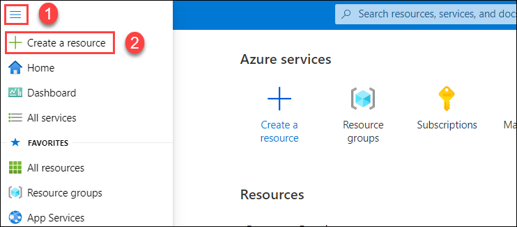
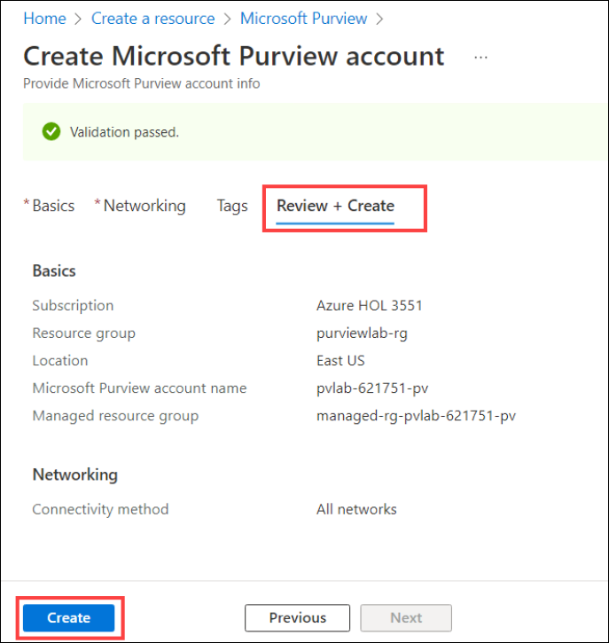

# Module 01 - Create a Microsoft Purview Account

## Introduction

Microsoft Purview is a unified data governance solution that helps you manage and govern your data at large. It combines many different services for scanning, collecting, organizing and sharing metadata. It uses a catalogue for discoverability, but also offers other features, such as automatic classification, sharing, access management and so on.

When planning your Microsoft Purview deployment, you first need to provision a Microsoft Purview account. Next, you need to define your collections for managing and grouping data assets together. A collection is a logical container in which your metadata, such as data sources, will be managed. When creating collections and placing them in a hierarchy, you need to make different considerations, such as your security requirements, governance structure and democratization needs. For example, a more centralized-alined style of data management leads to a different collection structure then a more domain-oriented style of data management. Depending on your needs, different topologies can be used for managing your data. Best practices for this can be found on [this website](https://docs.microsoft.com/azure/purview/concept-best-practices-collections).

## Objectives

* Create a Microsoft Purview account using the Azure portal.
* Provide additional users access to Microsoft Purview's data plane.

## Table of Contents

| #  | Section | Role |
| --- | --- | --- |
| 1 | [Create a Microsoft Purview Account](#1-create-an-azure-purview-account) | Azure Administrator |
| 2 | [Grant Access to Microsoft Purview's Data Plane](#2-grant-access-to-azure-purviews-data-plane) | Collection Administrator |

## 1. Create a Microsoft Purview Account

1. In the Azure portal, expand the left navigation menu and select **+ Create a resource**. 
    
    
    

2. In the marketplace search for **Microsoft Purview** and select it.

    

3. On the **Microsoft Purview** blade, select **Create**.

    

4. Provide the below inputs on the **Basics** tab.  

    > Note: Replace the **{randomId}** with the **Deployment Id** from the Environment Details Page.

    | Parameter  | Example Value |
    | --- | --- |
    | Subscription | `YOUR_AZURE_SUBSCRIPTION` |
    | Resource group | `purviewlab-rg` |
    | Purview account name | pvlab-**<inject key="Deployment ID" enableCopy="false"/>**-pv |
    | Location | `Choose the same region as the Resource Group` |
    | Managed Resource Group Name | managed-rg-pvlab-**<inject key="Deployment ID" enableCopy="false"/>**-pv |

    

    > **Did you know?**
    >
    > **Capacity Units** determine the size of the platform and is a **provisioned** (always on) set of resources that are needed to keep the Microsoft Purview platform up and running. 1 Capacity Unit can support approximately 25 data map operations per second and includes up to 2GB of metadata storage about data assets.
    >
    > Capacity Units are required regardless of whether you plan to invoke the Microsoft Purview API endpoints directly (i.e. ISV scenario) or indirectly via Purview Studio (GUI).
    >
    > Note: With the introduction of the [Elastic Data Map](https://docs.microsoft.com/en-us/azure/purview/concept-elastic-data-map), you no longer need to specify how many Capacity Units that you need. Microsoft Purview will scale capacity elastically based on the request load.
    > 
    > **vCore Hours** on the other hand, is the unit of measure for **serverless** compute that is needed to run a scan. You only pay per vCore Hour of scanning that you consume (rounded up to the nearest minute).
    >
    > For more information, check out the [Microsoft Purview Pricing](https://azure.microsoft.com/en-us/pricing/details/azure-purview/) page.

5. On the **Networking** tab, select **All networks**.
   
    

6. On the **Review + Create** tab, once the message in the ribbon returns "Validation passed", verify your selections and click **Create**.

    

7. Please wait for 5 - 10 minutes until the deployment is completed and then click on **Go to resource**.

    

## 2. Grant Access to Microsoft Purview's Data Plane

1. Navigate to your Microsoft Purview account and click **Open** on  **Microsoft Purview Governance Portal** tile.

    

2. On the left-hand side, navigate to **Data map**.

    

3. Select **Collections (1)** and click on **Role assignments (2)**.

    

4. On the **Role assignments** blade, scroll down and click on the **Add** icon that is next to **Data curators**.

    

5. Search for the user **user 01** within your Azure Active Directory, select their account and click OK.

    

    > **Did you know?**
    >
    > Microsoft Purview has a set of predefined data plane roles that can be used to control who can access what.
    >
    > For more information, check out [Access control in Microsoft Purview](https://docs.microsoft.com/en-us/azure/purview/catalog-permissions).

    | Role  | Collections | Catalog | Sources/Scans | Description | 
    | --- | --- | --- | --- | --- |
    | Collection Admin | `Read/Write` | | | Manage collections and role assignments. |
    | Data Reader ||  `Read` |  | Access to catalog (read only). |
    | Data Curator || `Read/Write` |  | Access to catalog (read & write). |
    | Data Source Admin |  || `Read/Write` | Manage data sources and data scans. |

## Knowledge Check

[http://aka.ms/purviewlab/q01](http://aka.ms/purviewlab/q01)

1. Which of the following Microsoft Purview pricing meters is **serverless** and used to support **data map population** through scanning and ingestion jobs?

    A ) Capacity Units  
    B ) vCore Hours  
    C ) Neither

2. Which of the following Microsoft Purview pricing meters is **always on** and used to support **data map consumption** through capacity and storage?

    A ) Capacity Units  
    B ) vCore Hours  
    C ) Neither

3. Which Microsoft Purview **feature** is included and billed with the consumption of the **data map**?

    A ) Data Estate Insights  
    B ) Search and browse of data assets  
    C ) SQL DevOps access

4. Which predefined Microsoft Purview role provides access to **manage data sources**?

    A ) Purview Data Reader  
    B ) Purview Data Curator  
    C ) Purview Data Source Administrator

## Summary

This module provided an overview on how to provision a Microsoft Purview account using the Azure Portal and how to grant the appropriate level of access to Microsoft Purview's data plane.
