# Module 04 - Glossary

## Introduction

A glossary is an important tool for maintaining and organizing your catalog. You build your glossary by defining new terms or importing a term list and then applying those terms to your assets.

## Objectives

* Create a Term in the Glossary using the System Default Term Template.
* Create a Term in the Glossary using a Custom Term Template.
* Bulk Import Terms into the Glossary via a CSV file.
* Bulk Export Terms from the Glossary into a CSV file.
* Assign a Term to an Asset in the Data Catalog.
* Update an existing Term with Related Terms and Contacts.

## Table of Contents

1. [Create a Term (System Default Term Template)](#1-create-a-term-system-default-term-template)
2. [Create a Term (Custom Term Template)](#2-create-a-term-custom-term-template)
3. [Bulk Import Terms](#3-bulk-import-terms)
4. [Bulk Export Terms](#4-bulk-export-terms)
5. [Assign a Term to an Asset](#5-assign-a-term-to-an-asset)
6. [Update an Existing Term](#6-update-an-existing-term)

## 1. Create a Term (System Default Term Template)

1. Open Purview Studio and from the **Data catalog** (1), click **Manage glossary** (2).

    

2. Click **New term**.

    

3. Select the **System default** term template and click **Continue**.

    > **Did you know?**
    >
    > A **Term Template** determines the attributes for a term. The **System default** term template has basic fields only (e.g. Name, Definition, Status, etc). **Custom** term templates on the other hand, can be used to capture additional custom attributes. For more information, check out [How to manage term templates for business glossary](https://docs.microsoft.com/en-us/azure/purview/how-to-manage-term-templates).

    

4. Change the **Status** of the term to `Approved` and then **copy** and **paste** the values below into the appropriate field, then click **Create**.

    **Status**
    ```
    Approved
    ```
    **Name**
    ```
    Contoso Parent
    ```
    **Definition**
    ```
    This will be the parent term.
    ```
    **Acronym**
    ```
    CP
    ```
    > **Info**: Click on **+ Add a resource** to add the resource.

    **Resource Name**
    ```
    Microsoft Purview
    ```
    **Resource Link**
    ```
    https://aka.ms/Azure-Purview
    ```
    
    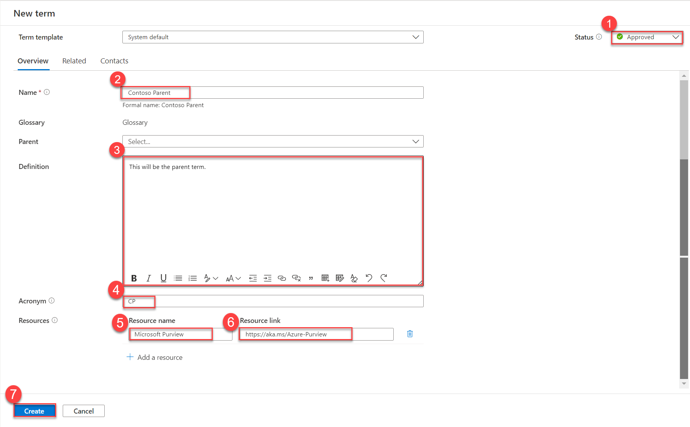

## 2. Create a Term (Custom Term Template)

1. Open Purview Studio and from the **Data catalog** (1), click **Manage glossary** (2).

    

2. Click **New term**.

    

3. Click **New term template**.

    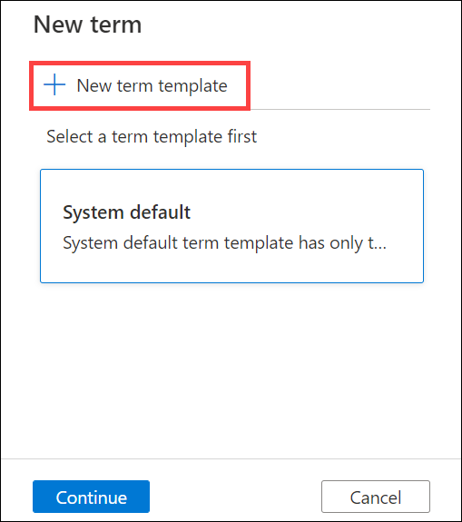

4. Provide the Term Template a **Name** as `Contoso Template` and click **New attribute**.

    

5. Populate the attribute fields as per the examples below and click **Apply**.

    | Field  | Example Value |
    | --- | --- |
    | Attribute name | `Business Unit` |
    | Field type | `Single choice` |
    | Choices | `Sales`, `Marketing`, `Finance`, `Human Resources`, `IT`, |

    > **Info**: Click on **Choices** to add a choice.

    

6. Click **Create**.

    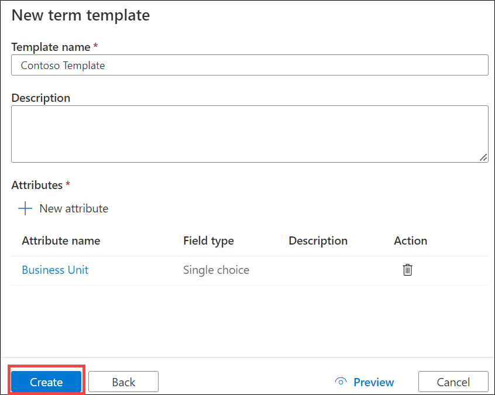

7. Select **Contoso Template** and click **Continue**.
    
    

8. Change the **Status** of the term to `Approved` and then **copy** and **paste** the values below into the appropriate field, then click **Create**.

    **Name**
    ```
    Contoso Child
    ```
   **Parent**
    ```
    Contoso Parent
    ```   
   **Definition**
    ```
    This will be the long description for the child glossary term.
    ```
    **Business Unit**
    ```
    Marketing
    ```
    
    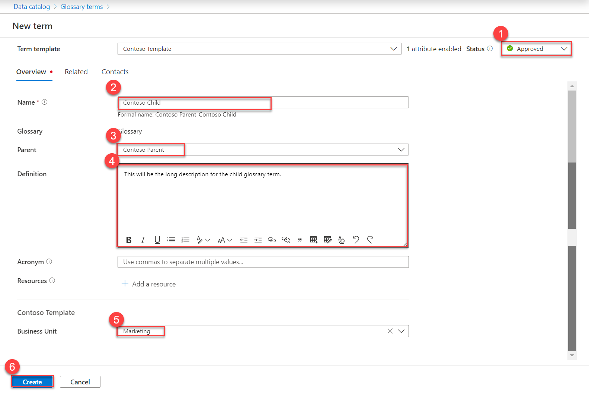


9. Navigate back to **Glossary** screen, change the view to **Hierarchical view** to see the hierarchical glossary.

    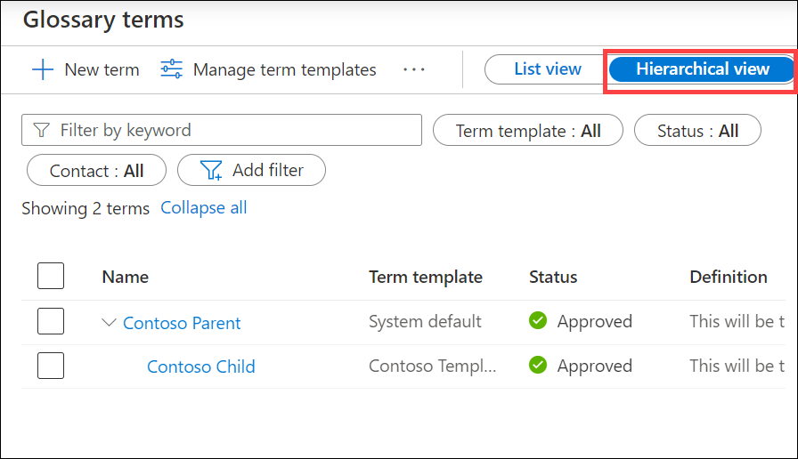
    
## 3. Bulk Import Terms

1. Download a copy of **[import-terms-sample.csv](https://github.com/tayganr/purviewlab/raw/main/assets/import-terms-sample.csv)** to your local machine by opening the link in a new tab, right-click within the body of the content, click **Save as** .

    
    
1. Select **All files** under **Save as type** and click on **Save**.

   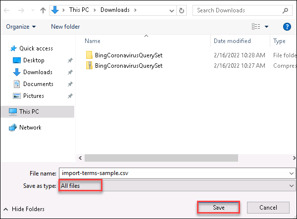

2. From the **Glossary** screen, click **Import terms**.

    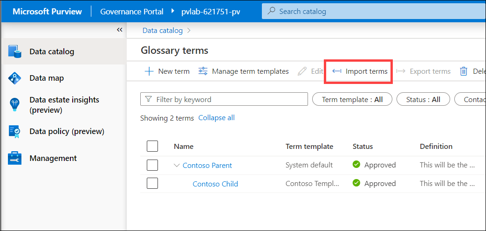

3. Select the **System default** term template and click **Continue**.

    

4. Click **Browse** and open the local copy of **import-terms-sample.csv**.

    

5. Click **OK**.

    

6. Once complete, you should see 50 additional terms beneath the parent (Workplace Analytics). **Tip**: You can quickly find specific types of terms using the filters at the top (e.g. Status = Approved).

    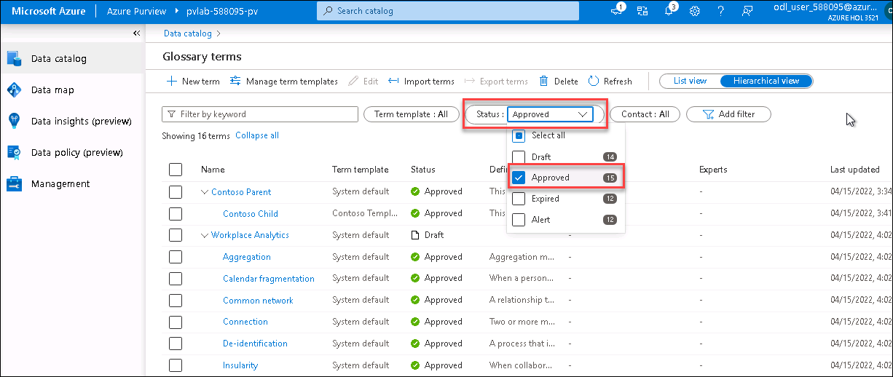

## 4. Bulk Export Terms

1. From the **Glossary** screen, we want to select ALL terms (top check box) and then de-select terms that do not belong to Workplace Analytics (i.e. Contoso Parent, Contoso Child). **All Workplace Analytics terms** should be selected. Click **Export terms**. Note: You can not export terms from different term templates.

    > **Did you know?**
    >
    > When using Purview Studio to **Export terms**, all terms selected for the export must use the same **Term template**. Selecting terms from different term templates will result in the **Export terms** button being greyed out.

    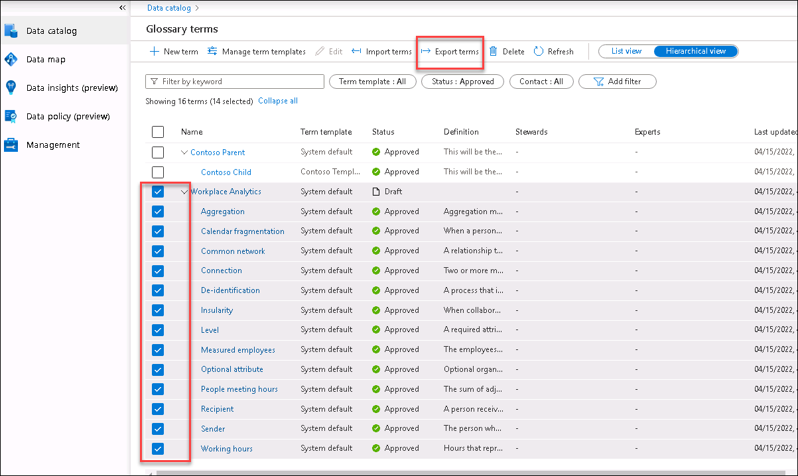

2. If the export was successful, you should find a **CSV** file has been copied to your local machine (e.g. Downloads).

    

## 5. Assign a Term to an Asset

1. Perform a wildcard search by typing asterisk (**\***) into the search bar and hitting the Enter key to submit the query. Click on an asset title `QueriesByState` to view the details.

    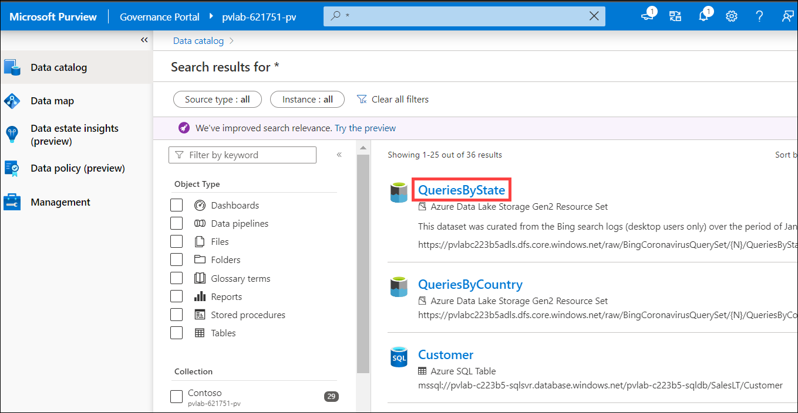

2. Click **Edit**.

    

3. Open the **Glossary terms** drop-down menu and select a glossary term named `Contoso Child`. Click **Save**.

    

4. Click on the **Contoso Child** hyperlinked term name to view the glossary term details.

    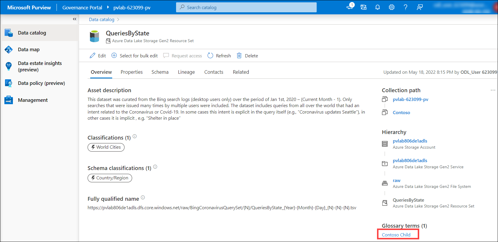

5. Click **Refresh** to view the **Catalog assets** the term is assigned to.

    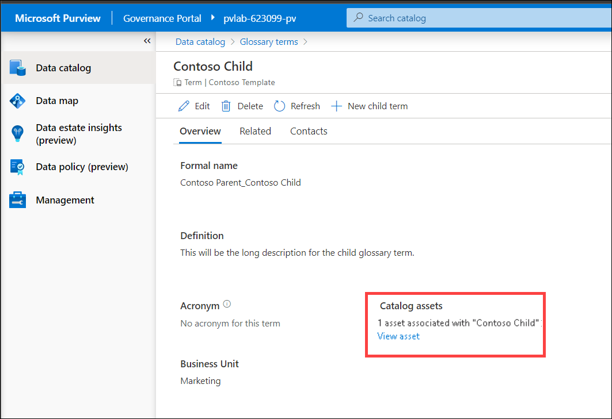
    
## 6. Update an Existing Term

1. From the **Glossary** screen, open an existing term `Aggregation`.

    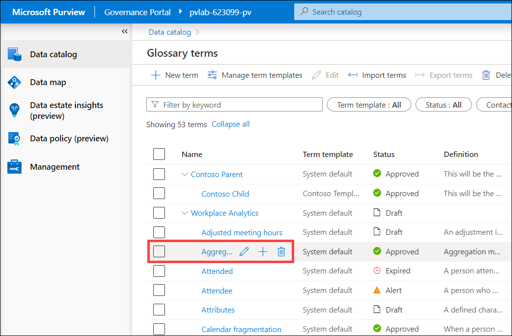

2. Navigate to the **Related** tab.

    

3. Use the drop-down menu to assign two glossary terms as **Synonyms**.

    > **Did you know?**
    >
    > **Synonyms** are other terms with the same or similar definitions. Where as **Related terms** are other terms that are related but have different definitions.

    

4. Use the drop-down menu to assign two glossary terms as **Related terms**.

    

5. Navigate to the **Contacts** tab, click **Edit** and assign an **Expert** and a **Steward** to the user named **ODL_User <inject key="DeploymentID" enableCopy="false" />**. Click **Save**.

    > **Did you know?**
    >
    > Glossary terms can be related to two different types of contacts. **Experts** are typically business process or subject matter experts. Where as **Stewards** define the standards for a data object or business term. They drive quality standards, nomenclature, rules.

    

## Knowledge Check

[http://aka.ms/purviewlab/q04](http://aka.ms/purviewlab/q04)

1. Glossary terms with the same name but different descriptions can exist under the same parent term?

    A ) True  
    B ) False 

2. Glossary terms can be related to other terms in the glossary. Which of the following is **not** a valid glossary term relationship type?

    A ) Synonyms  
    B ) Antonyms  
    C ) Related terms  

3. Glossary terms created using different term templates can be exported together using the Purview Studio (UI) glossary "Export terms" functionality?

    A ) True  
    B ) False  
    
## Summary

This module provided an overview of how to create, export, and import terms into the Microsoft Purview glossary.
