# Module 07 - Insights


```diff
!                               << PLEASE READ BEFORE PROCEEDING >>                                
!                                                                                                  
! * Data Estate Insights can take several hours to surface post the completion of a scan.          
! * At this point of the workshop, only a limited number of data visualisations may be populated.  
! * To populate all reports with data, Microsoft Purview requires an environment with a variety of 
! sources and assets to be scanned that is beyond the scope of this workshop.                      
! * The screenshots and information below, has been provided so that you can conceptualise the type
! of insights that can be gleaned from a fully populated environment.                              
```

## :loudspeaker: Introduction

Insights provides customers, a single pane of glass view into their catalog and further aims to provide specific insights to the data source administrators, business users, data stewards, data officer, and security administrators. Microsoft Purview currently has the following reports available:

**Health**

* Data stewardship

**Inventory and ownership**

* Assets

**Curation and governance**

* Glossary
* Classifications
* Sensitivity labels

## :thinking: Prerequisites

* An [Azure account](https://azure.microsoft.com/free/) with an active subscription.
* A Microsoft Purview account (see [module 01](../modules/module01.md)).
* Set up and complete a scan (see [module 02](../modules/module02.md)).

## :dart: Objectives

* Understand the different types of insights that can be gleaned from the out of the box reporting.

## :bookmark_tabs: Table of Contents

 1. [Data Stewardship Insights](#1-data-stewardship-insights) 
 2. [Assets Insights](#2-assets-insights) 
 3. [Glossary Insights](#3-glossary-insights) 
 4. [Classifications Insights](#4-classifications-insights) 
 5. [Sensitivity Labels Insights](#5-sensitivity-labels-insights) 

<div align="right"><a href="#module-07---insights">↥ back to top</a></div>

## 1. Data Stewardship Insights

View key metrics about your data estate's health and performance.

1. Open the **Microsoft Purview Governance Portal**, navigate to **Data estate insights** > **Data stewardship**.

    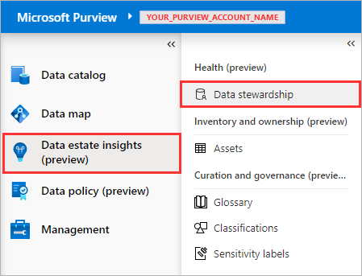

2. The Data Stewardship page displays the following **high-level metrics**.
    * **Number of Assets by Curation Status**
    * **Number of Assets by Ownership Status**
    * **Number of Monthly Active Users**

    

3. Further down the page you will find additional **data visualizations**, typically these tiles will allow interactive filtering and the ability to drill-down into the underlying detail by clicking **View details**. The Data Stewardship page includes the following **graphs**:

    **Data estate health**

    

    **Asset curation**

    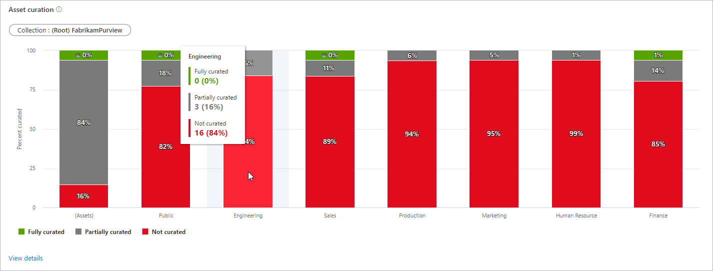

    **Trends and gap analysis**

    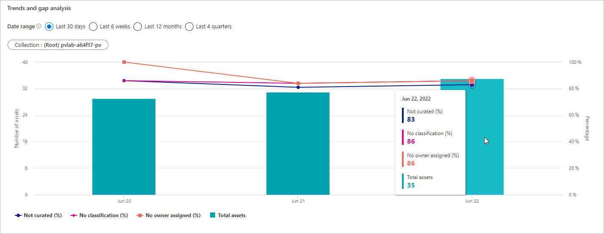

    **Active users by feature category**

    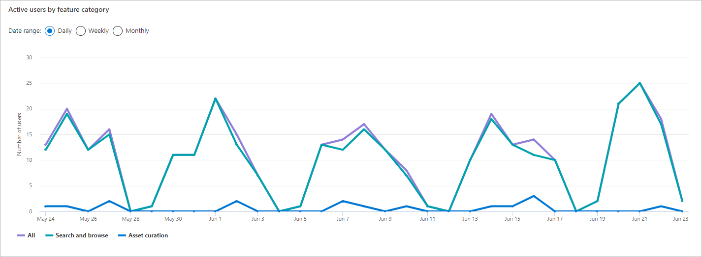

    **Most viewed assets**

    

    **Top searched keywords**

    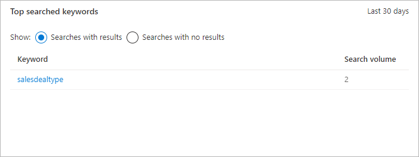

<div align="right"><a href="#module-07---insights">↥ back to top</a></div>

## 2. Assets Insights

View key metrics about your data estate's assets.

1. Open the **Microsoft Purview Governance Portal**, navigate to **Data estate insights** > **Assets**.

    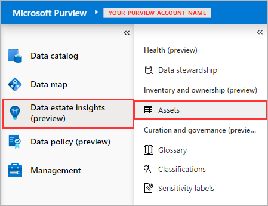

2. The Assets page displays the following **high-level metrics**.
    * **Number of Assets**
    * **Number of Assets by Classification Assignment Status**
    * **Number of Assets by Ownership Assignment Status**
    * **Number of New Assets (Last 30 days)**
    * **Number of Deleted Assets (Last 30 days)**

    

3. The Assets page includes the following **graphs**:

    **Data assets by collection or source type**

    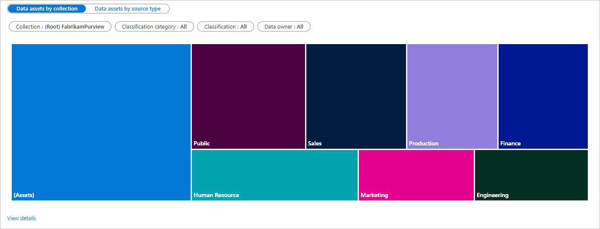

    **Top file extensions**

    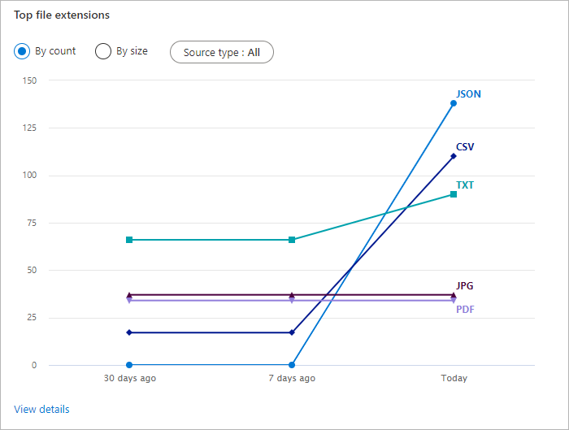

    **Files not stored in resource sets**

    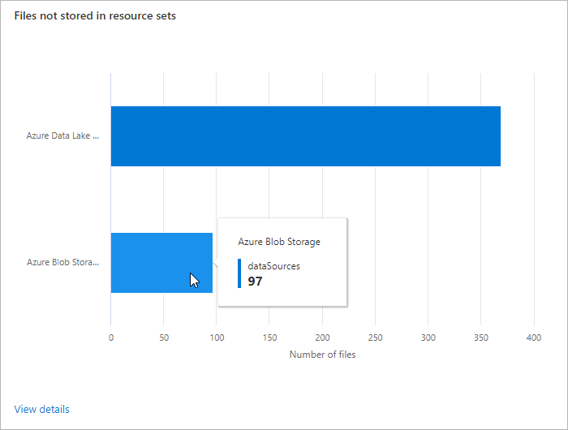

    > :bulb: **Did you know?**
    >
    > Using the quick filters on the **Data assets by source type** graph and drilling into the details by clicking **View details**, is a quick and easy way of identifying which sources contain certain types of data (e.g. set the **Classification category** filter to `Personal`).

<div align="right"><a href="#module-07---insights">↥ back to top</a></div>

## 3. Glossary Insights

View key metrics about glossary terms.

1. Open the **Microsoft Purview Governance Portal**, navigate to **Data estate insights** > **Glossary**.

    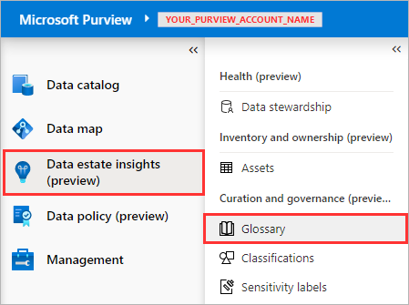

2. The Glossary page displays the following **high-level metrics**.
    * **Total Number of Terms**
    * **Total Number of Approved Terms without Assets**
    * **Total Number of Expired Terms with Assets**

    

3. The Glossary page includes the following **graphs**:

    **Top terms by asset count**

    

    **Terms with and without assets**

    

    **Incomplete terms**

    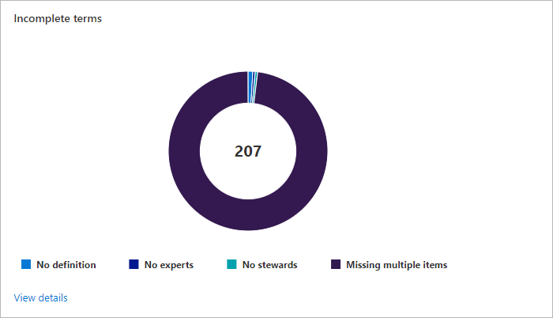

    > :bulb: **Did you know?**
    >
    > Terms are considered **incomplete** if they are missing a definition, expert, or steward. If a term is missing more than one of these things, it is shown as **Missing multiple items**.

<div align="right"><a href="#module-07---insights">↥ back to top</a></div>

## 4. Classifications Insights

View key metrics about the classifications applied to sources, files, and tables.

1. Open the **Microsoft Purview Governance Portal**, navigate to **Data estate insights** > **Classifications**.

    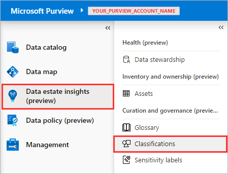

2. The Classifications page displays the following **high-level metrics**.
    * **Total Number of Classified Assets**
    * **Total Number of Files Classified**
    * **Total Number of Tables Classified**
    * **Total Number of Unique Classifications**
    * **Total Number of Sources Classified**

    

3. The Classifications page includes the following **graphs**:

    **Top sources with classified data (last 30 days)**

    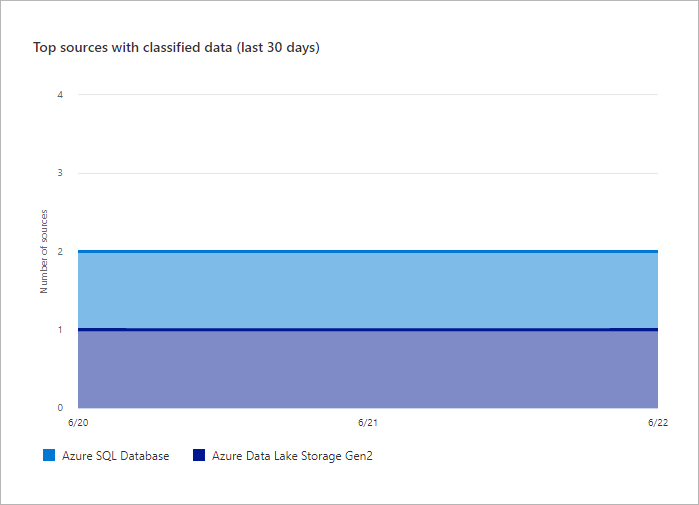

    **Top classification categories**

    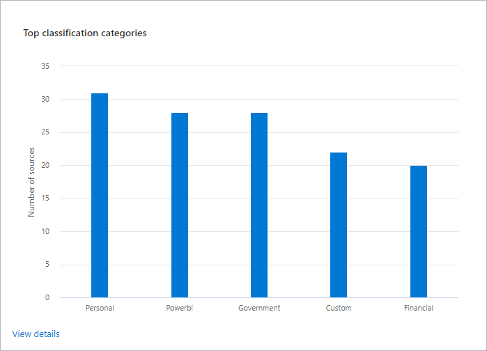

    **Number of Files by Classification**

    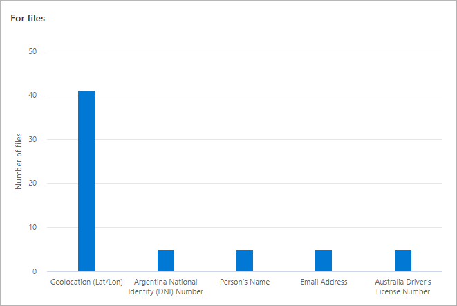

    **Number of Tables by Classification**

    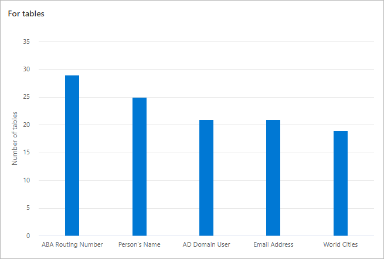

<div align="right"><a href="#module-07---insights">↥ back to top</a></div>

## 5. Sensitivity labels Insights

View key metrics about the sensitivity labels applied to sources, files, and tables.

1. Open the **Microsoft Purview Governance Portal**, navigate to **Data estate insights** > **Sensitivity labels**.

    > :bulb: **Did you know?**
    >
    > **Sensitivity labels** state how **sensitive** data is in your organization. For example, data contained within a particular asset might be `highly confidential`. **Classifications** on the other hand indicate the **type** of data values (e.g. Driver's License Number, Email Address, SWIFT Code, etc).
    >
    > Microsoft Purview's ability to apply sensitivity labels is controlled within the **Microsoft Purview Compliance Portal**. Note: You must have an active Microsoft 365 license that offers the benefit of automatically applying sensitivity labels. For more information, check out how to [How to label your data](https://docs.microsoft.com/azure/purview/how-to-automatically-label-your-content).

    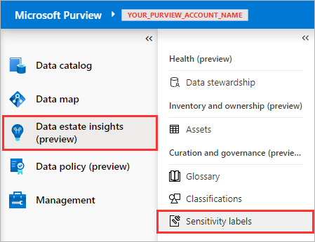

2. The Sensitivity Labels page displays the following **high-level metrics**.
    * **Total Number of Labeled Assets**
    * **Total Number of Labeled Files**
    * **Total Number of Labeled Tables**
    * **Total Number of Unique Labels**
    * **Total Number of Labeled Sources**

    

3. The Sensitivity Labels page includes the following **graphs**:

    **Top sources with labeled data (last 30 days)**

    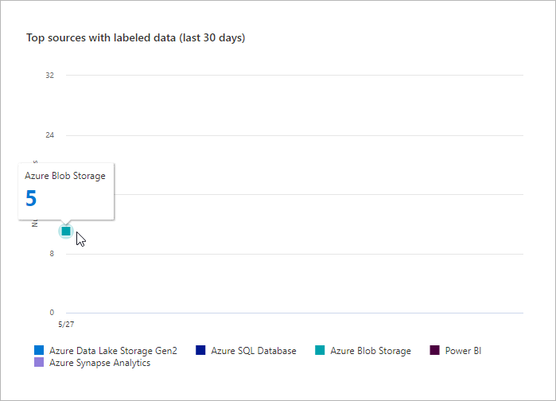

    **Top labels applied across sources**

    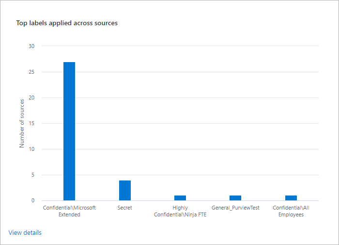

    **Number of Files by Label**

    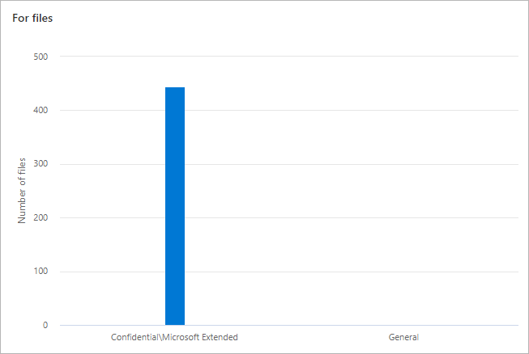

    **Number of Tables by Label**

    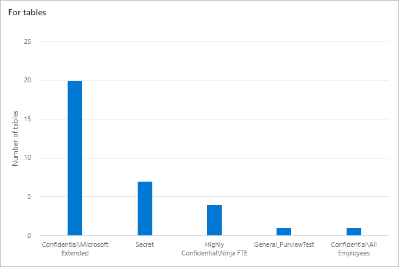

<div align="right"><a href="#module-07---insights">↥ back to top</a></div>

## :mortar_board: Knowledge Check

[https://aka.ms/purviewlab/q07](https://aka.ms/purviewlab/q07)

1. Which report would show the **number of assets**?

    A ) Assets  
    B ) Sensitivity labels  
    C ) Classification

2. A glossary term that does not have a steward (i.e. an assigned contact), is shown as an **incomplete term**.

    A ) True  
    B ) False

3. An asset has been tagged as `highly confidential`. Which type of tag is this?

    A ) Classification  
    B ) Category  
    C ) Sensitivity Label

<div align="right"><a href="#module-07---insights">↥ back to top</a></div>

## :tada: Summary

This module provided an overview of how to glean insights on Data stewardship, Assets, Glossary, Classifications and Sensitivity Labels across your data estate.


