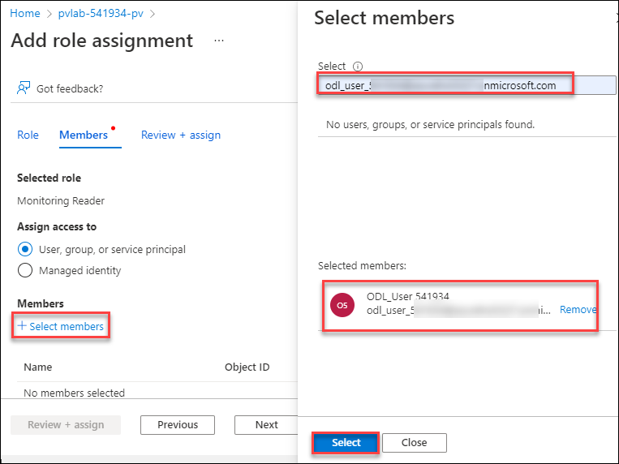
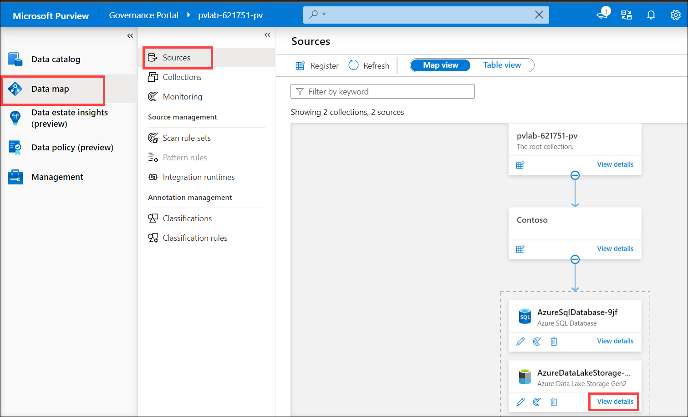
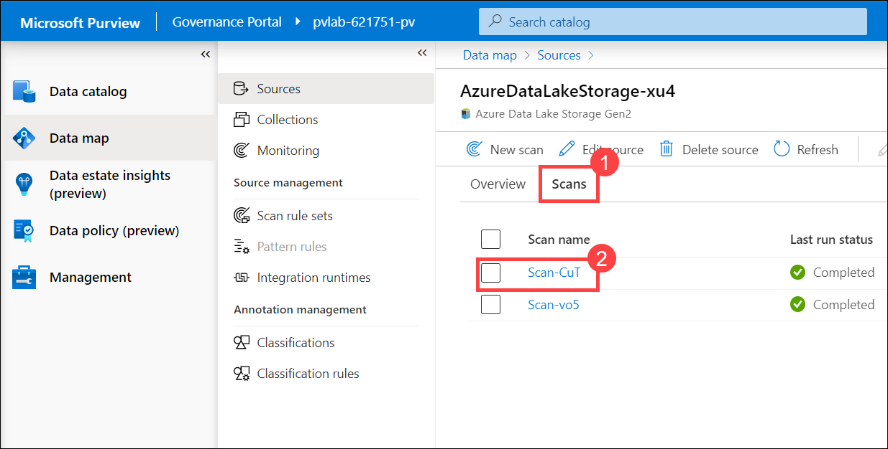
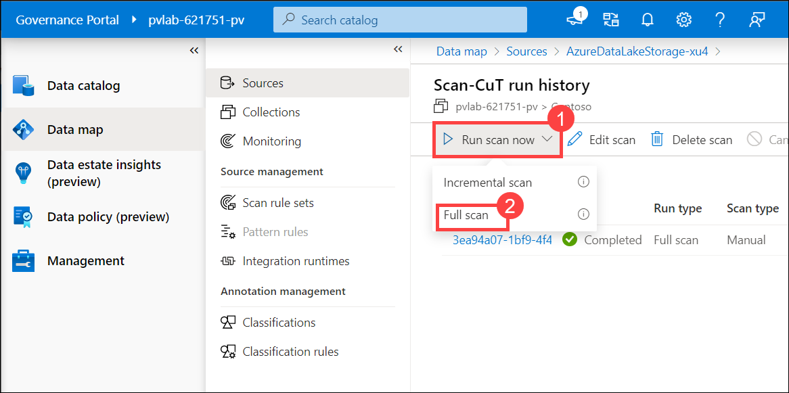
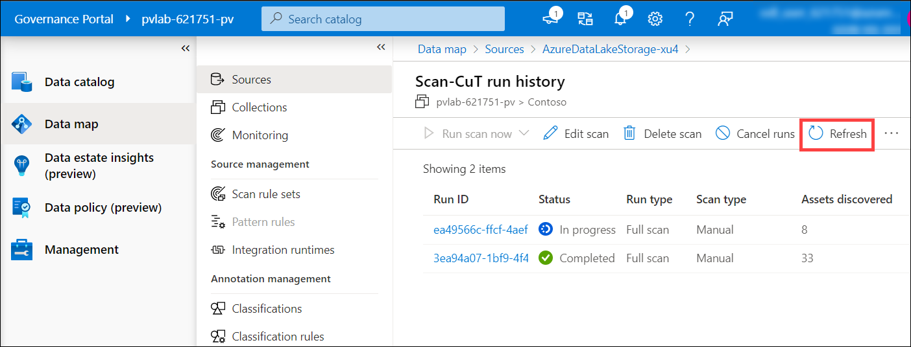
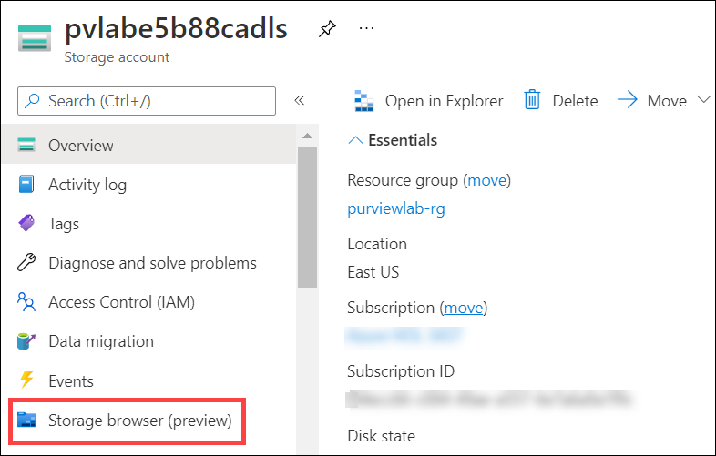
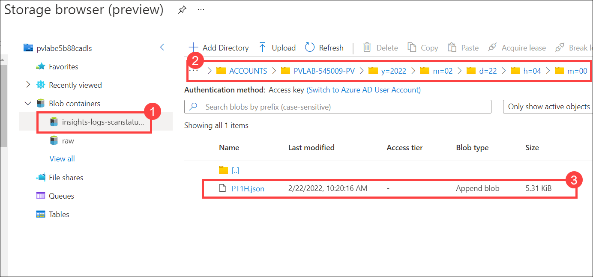

# Module 08 - Monitor

## Introduction

Azure Purview administrators can use Azure Monitor to track the operational state of an Azure Purview account instance. Metrics are collected to provide data points for you to track potential problems, troubleshoot, and improve the reliability of the Purview platform.

## Objectives

* View Azure Purview metrics.
* Send Azure Purview diagnostic logs to Azure Storage.

## Table of Contents

1. [Provide a User Access to Azure Purview Metrics](#1-provide-a-user-access-to-azure-purview-metrics)
2. [Visualize Azure Purview Metrics](#2-visualize-azure-purview-metrics)
3. [Send Diagnostic Logs to Azure Storage](#3-send-diagnostic-logs-to-azure-storage)

## 1. Provide a User Access to Azure Purview Metrics

Metrics can be accessed from the Azure Portal for an Azure Purview account instance. Access to the metrics can be granted via a role assignment.
* The person who created the Purview account automatically gets permissions to view metrics.
* Other individuals can be provided access by adding them to the **Monitoring Reader** role.

1. Sign in to the [Azure portal](https://portal.azure.com), navigate to your **Azure Purview** account (e.g. `pvlab-{randomId}-pv`), select **Access Control** and click **Add role assignment**.

    

2. Filter the list of roles by searching for `Monitoring Reader`, select the **Monitoring Reader** role and then click **Next**.

    

3. Click **Select members**, search for the user named **ODL_User <inject key="DeploymentID" enableCopy="false" />** in your Azure Active Directory and select that user from the list, and then click **Select**.

    > **Did you know?**
    >
    > **Monitoring Reader** role can view all monitoring data but cannot modify any resource or edit any settings related to monitoring resources. This role is appropriate for users in an organization such as Azure Purview administrators.

    

4. Click **Review + assign** to progress to the final screen, then click **Review + assign** once more to add the role assignment.

    

## 2. Visualize Azure Purview Metrics

1. Navigate to your **Azure Purview** account instance and click **Metrics**.

    

2. Click to open the **Metric** drop-down menu and select one of the metrics (e.g. `Scan time taken`).

    **Available Metrics**
    | Metric ID  | Metric Name | Metric Description |
    | --- | --- | --- |
    | ScanCancelled | `Scan Cancelled` | Indicates the number of scans cancelled. |
    | ScanCompleted | `Scan Completed` | Indicates the number of scans completed successfully. |
    | ScanFailed | `Scan Failed` | Indicates the number of scans failed. |
    | ScanTimeTaken | `Scan Time Taken` | Indicates the total scan time in seconds. |

    

3. Click on the chart type to change the graph to a **Bar chart**.

    

4. Click on the **time range** to change the duration to **Last 30 Days** and click **Apply**.

    

5. Below is an example. Note: The account instance would need some historical scan activity in order to visualize the metric. 

    

## 3. Send Diagnostic Logs to Azure Storage

1. Navigate to your **Azure Purview** account instance, click **Diagnostic settings** and select **Add diagnostic setting**.

    > **Did you know?**
    >
    > **Diagnostic settings** can be used to send platform logs and metrics to one or more destinations (Log Analytics Workspace, Storage Account, an Event Hub).

    

2. Provide the diagnostic setting a name as `Audit`, select **ScanStatusLogEvent**, select **Archive to a storage account**, select the existing storage account `pvlab{randomId}adls` and click **Save**.

    > **Did you know?**
    >
    > **ScanStatusLogEvent** tracks the scan life cycle. A scan operation follows progress through a sequence of states, from Queued, Running and finally a terminal state of Succeeded | Failed | Canceled. An event is logged for each state transition.

    

3. To test the capture of raw events, trigger a full scan by navigating to **Azure Purview Studio** > **Data map** > **Sources** and click **View details** on the existing **Azure Data Lake Storage Gen2** tile.

    

4. Navigate to the **Scans** tab and click the name of a previously run scan.

    

5. Open the **Run scan now** drop-down menu and select **Full Scan**.

    

6. Monitor the scan status by periodically clicking the **Refresh** button.

    

7. Once the scan is complete, navigate to the storage account named **pvlab{randomId}adls** within the Azure Portal, select **Storage Browser** from the left hand side menu.

    

8. Now, expand **Blob containers** and select **insights-logs-scanstatuslogevent**, navigate down the folder hierarchy until you reach a JSON document `PT1H.json`.

    

8. Download and open a local copy of the JSON document to see the details (e.g. dataSourceName, dataSourceType, assetsDiscovered, scanTotalRunTimeInSeconds, etc).

    

## Knowledge Check

[http://aka.ms/purviewlab/q08](http://aka.ms/purviewlab/q08)

1. Which built-in role is needed to provide users access to **view monitoring data**?

    A ) Purview Data Reader  
    B ) Metrics Reader  
    C ) Monitoring Reader

2. Which of the following is **not** available as an Azure Purview metric?

    A ) ScanCompleted  
    B ) ScanDuration  
    C ) ScanTimeTaken

3. The **ScanStatusLogEvent** schema contains an attribute that indicates the total run time. What is the name of this attribute?

    A ) scanTotalRunTime  
    B ) scanTotalRunTimeInSeconds  
    C ) scanTotalDuration

## Summary

This module provided an overview of how to visualize Azure Purview metrics within the Azure Portal and how to capture raw telemetry to an Azure Storage account.
