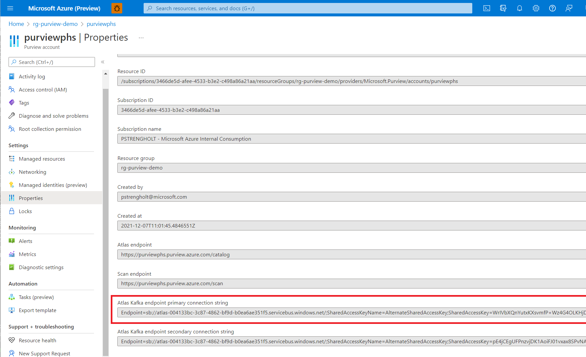
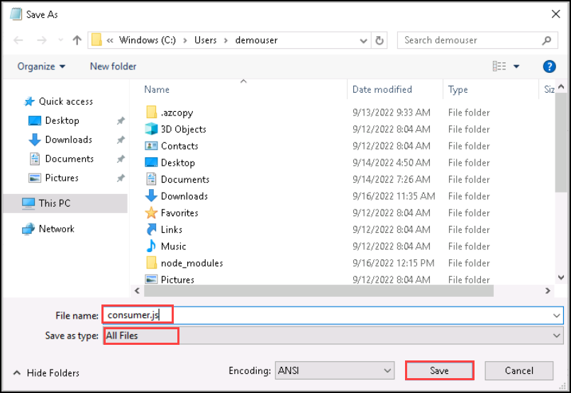
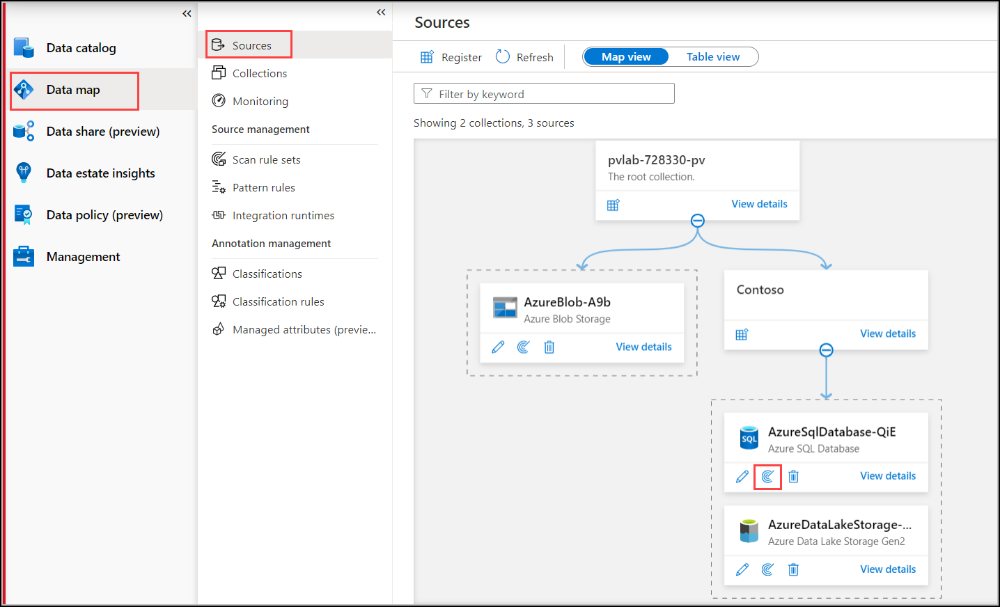
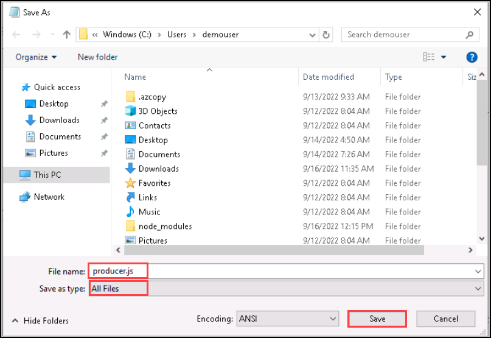
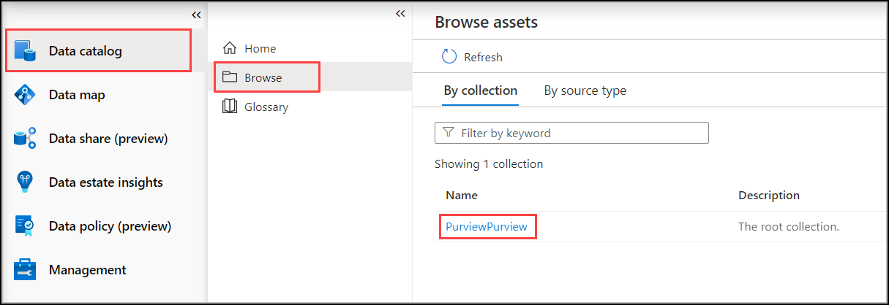
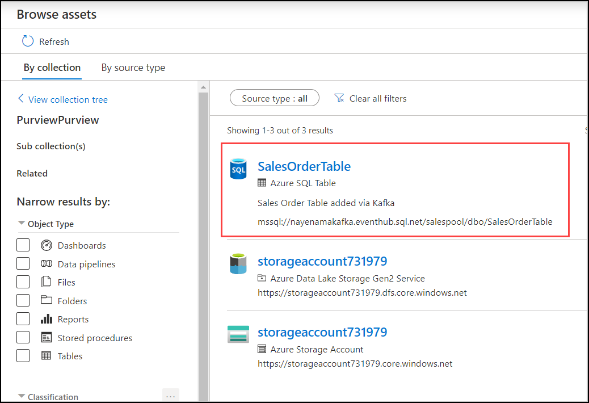

# Module 13 - Process events using Atlas Kafka topics via Event Hubs and NodeJS


## Introduction

Microsoft Purview is a unified data governance solution that runs on Azure. Some people say it is a data catalog, but Purview is a control framework for managing and controlling your data landscape. For example, you can use Microsoft Purview as a metastore for dynamically orchestrating your data pipelines.

When Microsoft Purview is deployed, a managed event hub is created as part of your Purview account creation. This opens up many possibilities when integrating Microsoft Purview with other applications. Because of the open nature of Microsoft Purview, you can automate and integrate different aspects. For example, you can trigger a workflow outside Microsoft Purview, when new data is scanned, or make an API call for fetching and storing additional metadata inside Purview. In this tutorial, you will see how this works.

In this lab you'll learn how read and publish events using Azure Event Hubs and NodeJS.

## Objectives

- Connect to on premise data source using a self-hosted integration runtime.

## Table of Contents

1. [Setup environment](#1-setup-environment)
2. [Read events](#2-read-events)
3. [Publish events](#3-publish-events)

<div align="right"><a href="#module-13---process-events-using-atlas-kafka-topics-via-event-hubs-and-nodejs">↥ back to top</a></div>

## 1. Setup environment

1. Go back to Azure portal, navigate to **Microsoft Purview account** and select **pvlab-{DID}-pv**.
 
2. In Microsoft Purview account, select **Properties** under settings and copy **Atlas Kafka endpoint primary connection string**.

   

3. Next we need to create a new project. You can simply do this by installing the required package for NodeJS, allowing to communicate with the Kafka Endpoint. In labvm open **Command prompt** run the following command.  

   ```
   npm install node-rdkafka
   ```
   
## 2. Read events

1. For reading events from Microsoft Purview you can use the sample code below. Open a notepad copy and paste the follwing script. The connection string in the configuration section at the top. All changes are published to the ATLAS_ENTITIES topic, so also pay attention to this.

   >**Note**: For **metadata.broker.list** replace it by your **Atlas Kafka endpoint**. As shown **Ex:- atlas-004133bc-3c87-4862-bf9d-b0ea6ae351f5.servicebus.windows.net** and for **sasl.password** copy and paste the entire **Atlas Kafka endpoint**.

   ```javascript
   var Transform = require('stream').Transform;
   var Kafka = require('node-rdkafka'); //See more info: https://github.com/Blizzard/node-rdkafka

   var consumer = new Kafka.KafkaConsumer({
      //'debug' : 'all',
      'metadata.broker.list': 'atlas-004133bc-3c87-4862-bf9d-b0ea6ae351f5.servicebus.windows.net:9093', //REPLACE
      'group.id': 'nodejs-cg', //The default consumer group for EventHubs is $Default
      'socket.keepalive.enable': true,
      'enable.auto.commit': false,
      'security.protocol': 'SASL_SSL',
      'sasl.mechanisms': 'PLAIN',
      'sasl.username': '$ConnectionString', //do not replace $ConnectionString
      'sasl.password': 'Endpoint=sb://atlas-004133bc-3c87-4862-bf9d-b0ea6ae351f5.servicebus.windows.net/;SharedAccessKeyName=AlternateSharedAccessKey;SharedAccessKey=WrIVbXQnYutxKXsvmfP+Wz4G4OLKHjDtuuR8sdfsE1=', //REPLACE
   });

   //Purview's default topic name: https://docs.microsoft.com/azure/purview/manage-kafka-dotnet
   var topicName = 'ATLAS_ENTITIES';

   //logging debug messages, if debug is enabled
   consumer.on('event.log', function(log) {
      console.log(log);
   });

   //logging all errors
   consumer.on('event.error', function(err) {
      console.error('Error from consumer');
      console.error(err);
   });

   consumer.on('ready', function(arg) {
      console.log('consumer ready.' + JSON.stringify(arg));

      consumer.subscribe([topicName]);
         //start consuming messages
         consumer.consume();
   });

   consumer.on('data', function(event) {
      // Output the actual message contents
      const obj = JSON.parse(event.value);
      console.log(obj);
   });

   consumer.on('disconnected', function(arg) {
      console.log('consumer disconnected. ' + JSON.stringify(arg));
   });

   //starting the consumer
   consumer.connect();

   //stopping this example after 300s
   setTimeout(function() {
      consumer.disconnect();
   }, 300000);
   ```
     
     
    
2. The file should be saved as **consumer.js**, and you should select **All Files** under Save as type, in the location `C:\Users\demouser` and click on **Save**. 

     

3. When everything is configured properly you can start the script in **Command prompt** by running the following command:

   ```
   node consumer.js
   ```

4. For creating notifications go back to your Microsoft Purview Governance Portal. Make some changes to your environment, for example, by scanning an existing source. 
   
   > **Note**: For scanning the existing source refer [module 12](../modules/module02.md) task-5.
   
   
   
   * If everything goes well, you should see the following output on the screen:
   
     

5. In the output above, you see an Array with classifications and operation type using CLASSIFICATION_ADD. This, for example, you could use to trigger a workflow or send out an email requiring somebody to investigate the newly scanned data. Or you see new data coming in via the ENTITY_UPDATE operation type, allowing you to trigger process or pipeline.

## 3. Publish events

1. The same endpoint we could also use to submit events. Important here is that we should change the topic name to ATLAS_HOOK. In the example below you can use a JSON message to create a SQL table including two columns:

    >**Note**: For **metadata.broker.list** replace it by your **Atlas Kafka endpoint**. As shown
          `Ex:- atlas-004133bc-3c87-4862-bf9d-b0ea6ae351f5.servicebus.windows.net` and for **sasl.password** copy and paste the entire **Atlas Kafka endpoint**.

   ```javascript
   var Kafka = require('node-rdkafka');

   var producer = new Kafka.Producer({
   //'debug' : 'all',
   'metadata.broker.list': 'atlas-004133bc-3c87-4862-bf9d-b0ea6ae351f5.servicebus.windows.net:9093', //REPLACE
   'dr_cb': true,  //delivery report callback
   'security.protocol': 'SASL_SSL',
   'sasl.mechanisms': 'PLAIN',
   'sasl.username': '$ConnectionString', //do not replace $ConnectionString
   'sasl.password': 'Endpoint=sb://atlas-004133bc-3c87-4862-bf9d-b0ea6ae351f5.servicebus.windows.net/;SharedAccessKeyName=AlternateSharedAccessKey;SharedAccessKey=WrIVbXQnYutxKXsvmfP+Wz4G4OLKHjDtuKH&6=' //REPLACE
   });

   var topicName = 'ATLAS_HOOK';

   //logging debug messages, if debug is enabled
   producer.on('event.log', function(log) {
   console.log(log);
   });

   //logging all errors
   producer.on('event.error', function(err) {
   console.error('Error from producer');
   console.error(err);
   });

   //counter to stop this sample after maxMessages are sent
   var counter = 0;
   var maxMessages = 1;

   producer.on('delivery-report', function(err, report) {
   console.log('delivery-report: ' + JSON.stringify(report));
   counter++;
   });

   //Wait for the ready event before producing
   producer.on('ready', function(arg) {
   console.log('producer ready.' + JSON.stringify(arg));

   for (var i = 0; i < maxMessages; i++) {
      var value = new Buffer(`{
         "msgCreatedBy":"nayenama",
         "message":{
            "type":"ENTITY_CREATE_V2",
            "user":"admin",
            "entities":{
               "entities":[
                     {
                        "typeName":"azure_sql_table",
                        "attributes":{
                           "owner":"admin",
                           "temporary":false,
                           "qualifiedName":"mssql://nayenamakafka.eventhub.sql.net/salespool/dbo/SalesOrderTable",
                           "name":"SalesOrderTable",
                           "description":"Sales Order Table added via Kafka"
                        },
                        "relationshipAttributes":{
                           "columns":[
                                 {
                                    "guid":"-1102395743156037",
                                    "typeName":"azure_sql_column",
                                    "uniqueAttributes":{
                                       "qualifiedName":"mssql://nayenamakafka.eventhub.sql.net/salespool/dbo/SalesOrderTable#OrderID"
                                    }
                                 },
                                 {
                                    "guid":"-1102395743156038",
                                    "typeName":"azure_sql_column",
                                    "uniqueAttributes":{
                                       "qualifiedName":"mssql://nayenamakafka.eventhub.sql.net/salespool/dbo/SalesOrderTable#OrderDate"
                                    }
                                 }
                           ]
                        },
                        "guid":"-1102395743156036",
                        "version":0
                     }
               ],
               "referredEntities":{
                     "-1102395743156037":{
                        "typeName":"azure_sql_column",
                        "attributes":{
                           "owner":null,
                           "userTypeId":61,
                           "qualifiedName":"mssql://nayenamakafka.eventhub.sql.net/salespool/dbo/SalesOrderTable#OrderID",
                           "precision":23,
                           "length":8,
                           "description":"Sales Order ID",
                           "scale":3,
                           "name":"OrderID",
                           "data_type":"int"
                        },
                        "relationshipAttributes":{
                           "table":{
                                 "guid":"-1102395743156036",
                                 "typeName":"azure_sql_table",
                                 "entityStatus":"ACTIVE",
                                 "displayText":"SalesOrderTable",
                                 "uniqueAttributes":{
                                    "qualifiedName":"mssql://nayenamakafka.eventhub.sql.net/salespool/dbo/SalesOrderTable"
                                 }
                           }
                        },
                        "guid":"-1102395743156037",
                        "version":2
                     },
                     "-1102395743156038":{
                        "typeName":"azure_sql_column",
                        "attributes":{
                           "owner":null,
                           "userTypeId":61,
                           "qualifiedName":"mssql://nayenamakafka.eventhub.sql.net/salespool/dbo/SalesOrderTable#OrderDate",
                           "description":"Sales Order Date",
                           "scale":3,
                           "name":"OrderDate",
                           "data_type":"datetime"
                        },
                        "relationshipAttributes":{
                           "table":{
                                 "guid":"-1102395743156036",
                                 "typeName":"azure_sql_table",
                                 "entityStatus":"ACTIVE",
                                 "displayText":"SalesOrderTable",
                                 "uniqueAttributes":{
                                    "qualifiedName":"mssql://nayenamakafka.eventhub.sql.net/salespool/dbo/SalesOrderTable"
                                 }
                           }
                        },
                        "guid":"-1102395743156038",
                        "status":"ACTIVE",
                        "createdBy":"ServiceAdmin",
                        "version":0
                     }
               }
            }
         },
         "version":{
            "version":"1.0.0"
         },
         "msgCompressionKind":"NONE",
         "msgSplitIdx":1,
         "msgSplitCount":1
   }`);
      var key = "key-"+i;
      // if partition is set to -1, librdkafka will use the default partitioner
      var partition = -1;
      producer.produce(topicName, partition, value, key);
   }

   //need to keep polling for a while to ensure the delivery reports are received
   var pollLoop = setInterval(function() {
         producer.poll();
         if (counter === maxMessages) {
         clearInterval(pollLoop);
         producer.disconnect();
         }
      }, 1000);

   });

   producer.on('disconnected', function(arg) {
   console.log('producer disconnected. ' + JSON.stringify(arg));
   });

   //starting the producer
   producer.connect();
   ```

   

2. The file should be saved as **producer.js**, and you should select **All Files** under Save as type, in the location `C:\Users\demouser` and click on **Save**.  

    

3. To submit this message to the Kafka endpoint. Run the following command in **Command prompt**:

   ```
   node producer.js
   ```

4. If everything goes well you see the following output:

   

5. Go back to the **Microsoft Purview**, select **Data Catalog** from the left menu, click on **Browser** and under Browse assets balde select your **Purview account**.

    

6. And finally you should see your newly created **SalesOrderTable**.

   

As demonstrated in this tutorial you can programmatically monitor for metadata changes in real-time. Via this approach you can enrich your user experience by also integrating with other services.

<div align="right"><a href="#module-13---process-events-using-atlas-kafka-topics-via-event-hubs-and-nodejs">↥ back to top</a></div>

## Knowledge Check

1. When publishing events to Microsoft Purview you need to make use of the ATLAS_HOOK topic name.

   A) True  
   B) False

<div align="right"><a href="#module-13---process-events-using-atlas-kafka-topics-via-event-hubs-and-nodejs">↥ back to top</a></div>

## Summary

In this module, you learned how to send events to and receive events from Microsoft Purview's Atlas Kafka topics via event hub using the NodeJS library. If you'd like continue with this module to complete further tasks, please feel free to complete the tutorial links below:

- [Publish messages to and process messages from Microsoft Purview's Atlas Kafka topics via Event Hubs using .NET](https://docs.microsoft.com/azure/purview/manage-kafka-dotnet)
- [Modern Data Pipelines with Azure Synapse Analytics and Microsoft Purview](https://piethein.medium.com/modern-data-pipelines-with-azure-synapse-analytics-and-microsoft-purview-fe752d874c67)

