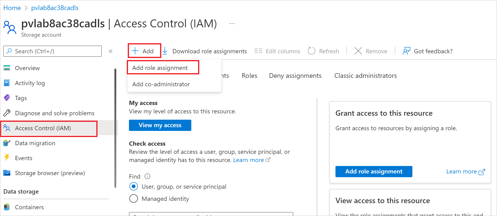
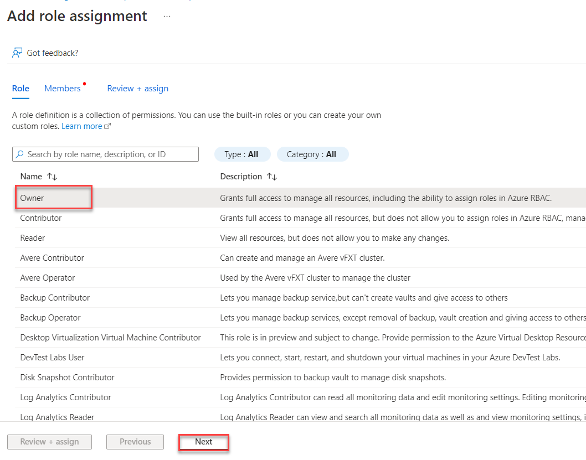
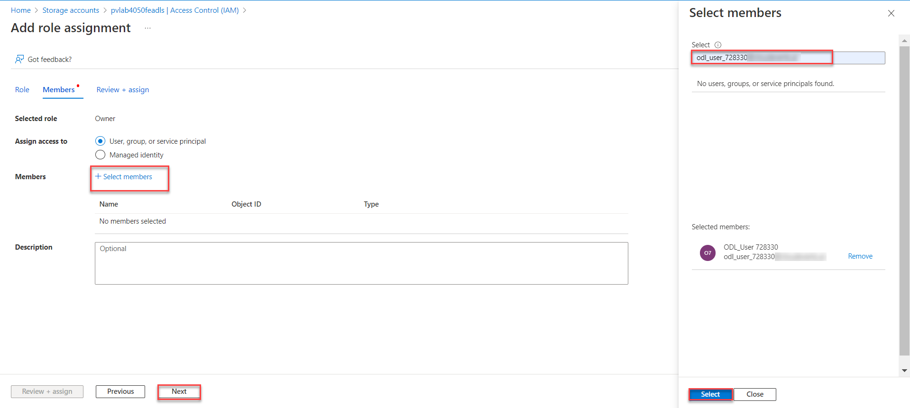
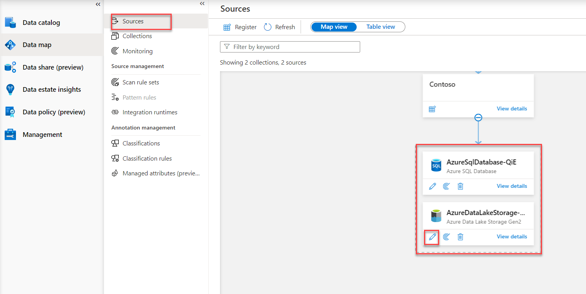
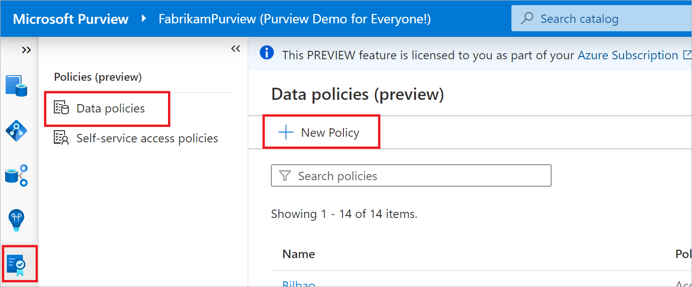
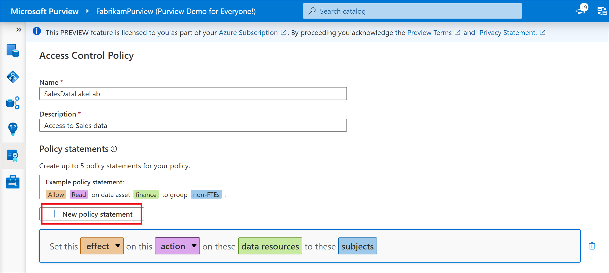
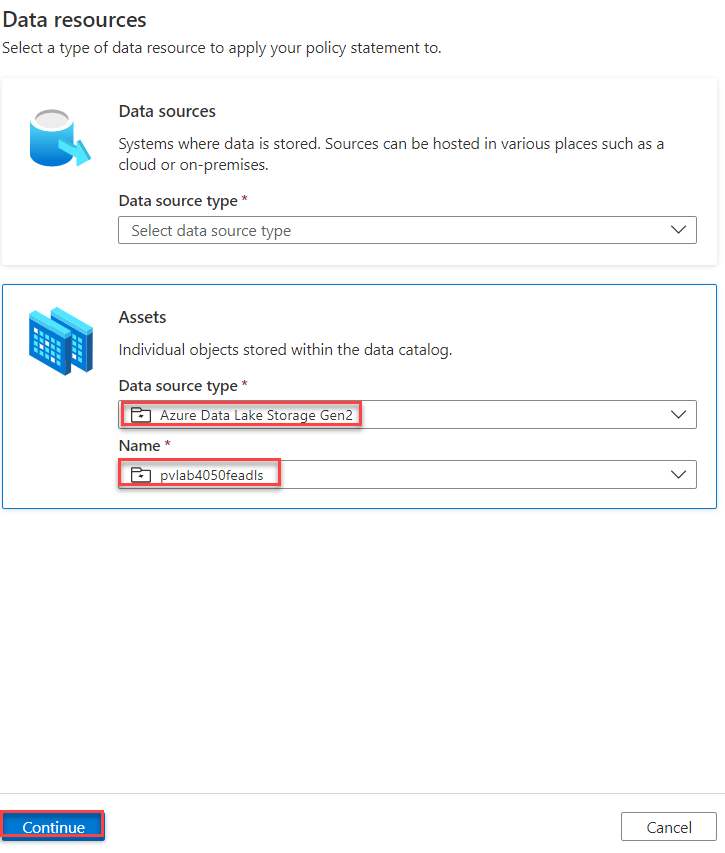
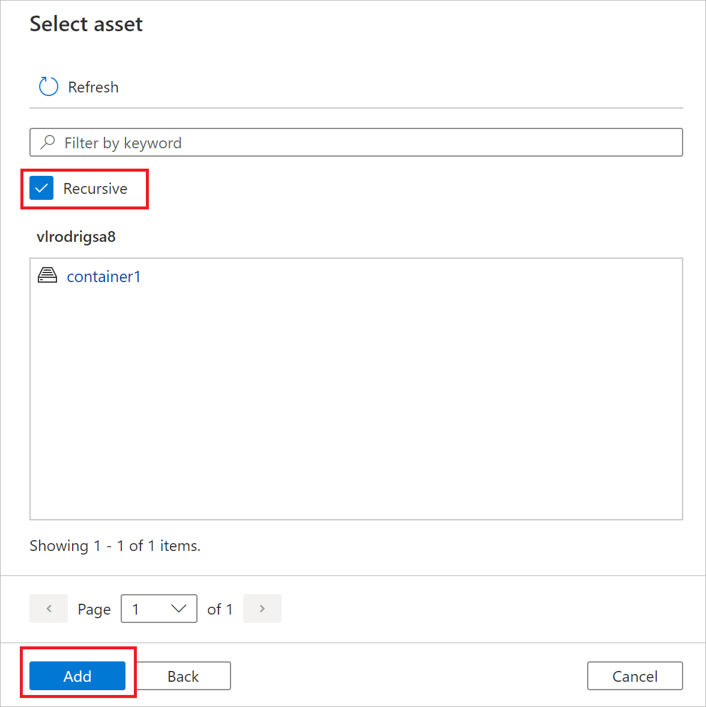
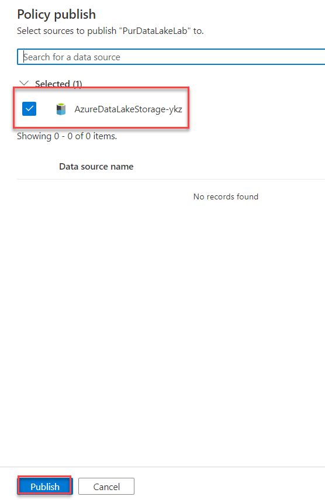

# Module 14 - Data owner policies (Azure Storage)

[< Previous Module](../modules/module13.md) - **[Home](../README.md)** - [Next Module >](../modules/module15.md)

## :loudspeaker: Introduction

A new feature of Purview is Policies, which enables you to secure your data estate from within the Microsoft Purview Governance Portal. This feature is in Preview as of July 2022.

Data access policies can be enforced through Purview on data systems that have been registered in Purview for scanning and data use management. This feature allows Data stewards and owners to grant read, write access to various data stores from within Purview by creating a data access policy through the Policy Management app in the governance portal, enabling a single dashboard view of all access granted to all systems.

A **policy** is a named collection of policy statements. When a policy is published to one or more data systems under Purview’s governance, it's then enforced by the system. A policy definition includes a policy name, description, and a list of one or more policy statements.

## :thinking: Prerequisites

* An Azure account with an active subscription.
* An Azure Data Lake Storage Gen2 Account (see module 00) in same subscription.
* A Azure SQL DB account in same subscription.
* A Microsoft Purview account (see module 01).

## :dart: Objectives

* Register data source for data use management
* Create data owner access policy for Azure Storage

## :bookmark_tabs: Table of Contents

| #  | Section | Role |
| --- | --- | --- |
| 1 | [Configure permissions for policy management actions](#1-configure-permissions-for-policy-management-actions) | Collection Admin |
| 2 | [Author and Publish policies for an Azure Storage](#2-Author-and-Publish-policies-for-an-Azure-Storage) | Data Source Administrator / Policy Author |

<a href="#module-14---data-owner-policies-azure-storage">↥ back to top</a>

## 1. Configure permissions for policy management actions

To make a data resource available for policy management, the Data Use Management (DUM) toggle needs to be enabled. A user, who will manage the policies in Purview, will need certain IAM privileges on the resource and MS Purview in order to enable the DUM toggle.

1. To grant IAM privileges to the user on the storage resource. Navigate to the **Access Control (IAM)** page of the storage account **pvlabxxxadls**. Click on **+ Add** --> **Add role assignment**. 

     

     
2. On the **Add role assignment** page select **Owner** and move to the **Members** tab by clicking on **Next**.

   
   
3. On the **Members** tab click on **+ Select member** search for your ODL user and add then click on **Select**. 
   
   > **Note**: You can the get the ODL user ID from the **Environment details** page.
   
    

4. On the Review+assign page click **Review+assign** to add the role.
     
      

5. Navigate to the Azure purview tab on your browser. In Purview grant the same user **Policy authors** role at the root collection level. Navigate to **Data map** >**Collections**>**Role assignments**. On the **Policy authors** click on **Add policy author**.

     

6. Search for your ODL user on the **Add or remove policy authors** tab and add, click **Ok**.

   
   
 7. Next move to the **Source** on the **Data map** , click on edit for **AzureDataLakeStorage** on the map view.
    
      

8. Enable Data Use Management. After a source is registered, edit the source. Set the **Data Use Management** toggle to **Enabled** as shown below and **Apply**.

    

    > :bulb: **Did you know?**
    >
    > **DSA** role can publish a policy.  
    > **Policy authors** role can create or edit a policy.

<a href="#module-14---data-owner-policies-azure-storage">↥ back to top</a>

## 2. Author and Publish policies for an Azure Storage

1. In the Microsoft Purview governance portal, navigate to the Data policy feature using the left side panel as shown

    

2. On the new policy page, enter the **Name** and **Description** of the policy and select the **New policy statement** button, to add a new policy.

    

3. Select the **Effect** dropdown and choose **Allow**.

4. Select the **Action** dropdown and choose **Read** or **Modify**.

5. Select the **Data Resources** button This will bring up a window to enter the Data resource information. Use the **Assets** box and enter the **Data Source Type** -**"Azure Data Lake Storge Gen2"** and the **Name**-**"pvlabxxxadls"** of a previously registered and scanned data source.

    

6. Select the **Continue** button and transverse the hierarchy to select and underlying data-object (for example: folder, file, etc.). Select **Recursive** to apply the policy from that point in the hierarchy down to any child data-objects. Then select the **Add** button. This will take you back to the policy editor.
    
    

7. Select the **Subjects** button and enter **`odl_user_DID@cloudevents.ai`** identity as a principal, group, or MSI. Then select the **OK** button. This will take you back to the policy editor.

    

8. Select the **Save** button to save the policy.
9. Select the newly created policy from the list of policies on the the Policy portal. Select the **Publish** button on the right top corner of the page.

    

10. A list of data sources is displayed. You can enter a name to filter the list. Then, select each data source where this policy is to be published and then select the **Publish** button.

    
  
  11. If everything works you should be able to see your **Data lake storage** under **Resources published to**!
    
   

<a href="#module-14---data-owner-policies-azure-storage">↥ back to top</a>

## :mortar_board: Knowledge Check

1. The data source has to be scanned before the policy can be published on it.

    A ) True  
    B ) False  

2. Which role is needed for a user to be able to publish the policy.

    A ) Policy Author  
    B ) Owner  
    c ) Data Source Administrator  

3. Once the policy is published, it cannot be edited

    A ) True  
    B ) False  

<a href="#module-00---title">↥ back to top</a>

## :tada: Summary

Purview policies allow you to manage access to data source from within the governance portal.

[Continue >](../modules/module15.md)
