# Module 15 - Azure SQL Database Lineage Extraction

## Introduction

As you've learned in the [Lineage Module](../modules/module06.md), Microsoft Purview can show us how data moves through various systems; this is referred to as data lineage and part of the lifecycle of any piece of data in an organization.

Lineage extraction is a complicated process because there are many ways data may be moved and transformed throughout its lifecycle. Lineage information can either be extracted by Purview during the scanning process (when supported), or lineage information can be pushed to Purview via the Apache Atlas REST API.

In this module, we'll implement the Azure SQL Database Lineage Extraction functionality.

## Objectives

* Connect an Azure SQL Database with a Microsoft Purview account, with lineage extraction enabled.
* Observe scanning process and examine lineage extracted by using the sample code below.

##  Table of Contents


 1.  [Add Azure SQL Database Administrator](#1-add-azure-sql-database-administrator) 
 2.  [Configure the Microsoft Purview MSI in the Azure SQL Database](#2-configure-the-microsoft-purview-msi-in-the-azure-sql-database)
 3.  [Configure the Microsoft Purview MSI in the Azure SQL Database](#2-configure-the-microsoft-purview-msi-in-the-azure-sql-database)
 4.  [Add example tables and stored procedure to Azure SQL Database](#3-add-example-tables-and-stored-procedure-to-azure-sql-database) 
 5.  [Add a new Azure SQL Database Scan with lineage enabled](#4-add-a-new-azure-sql-database-scan-with-lineage-enabled) 
 6.  [Execute the stored procedure to simulate data movement](#5-execute-the-stored-procedure-to-simulate-data-movement) 
 7.  [Re-run lineage scan and observe output](#6-re-run-lineage-scan-and-observe-output) 
 8.  [Clean-up and considerations](#7-clean-up-and-considerations) 


## 1. Add Azure SQL Database Administrator

In order for Microsoft Purview to be able to scan for lineage in an Azure SQL Database, we'll need to configure the appropriate permissions. In the steps below, we'll assume you are using the Azure SQL Database provisioned in this lab. If you are using a new or other Azure SQL Database, apply these steps to that database.

1. From the **Azure portal**, open the **Azure SQL Database server**, select **Azure Active Directory**, and click **Set admin**. In the menu that appears, search for your **ODL_User** and click **Select** and **Save**.

    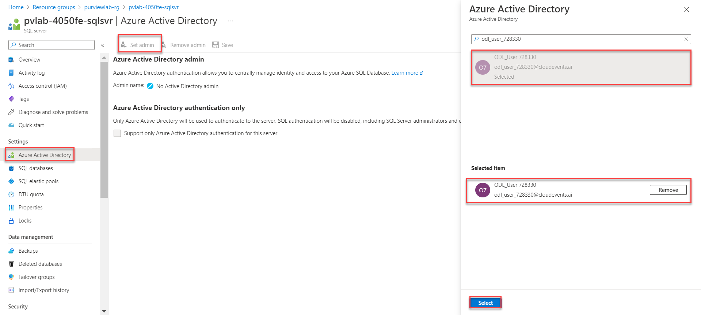


> **Did you know?**
>
> An Azure AD account is required do add the Microsoft Purview MSI in the next step.


## 2. Configure the Microsoft Purview MSI in the Azure SQL Database

1. From the **Azure portal**, open the **Azure SQL Database** instance and select **Query editor**. Log into the **Query editor** using your **ODL_User** account.

    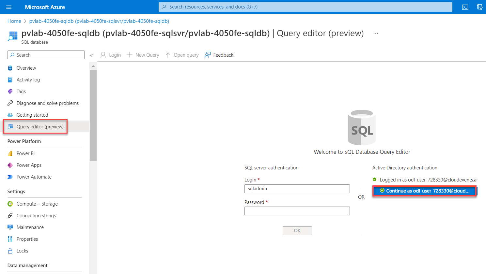

2. From within the Query window, run the following command. Be sure to replace **[PurviewExample]** with the name of your Microsoft Purview account i.e **pvlab-DID-pv** :

```sql
CREATE MASTER KEY

-- PurviewExample is the name of the Microsoft Purview account
CREATE USER [PurviewExample] FROM EXTERNAL PROVIDER
GO
EXEC sp_addrolemember 'db_owner', [PurviewExample] 
GO
```
The SQL statements above will: 
* Create a Master Key if it does not already exist.
* Add the Microsoft Purview Managed Identity as a user in the Azure SQL Database.
* Assign the Microsoft Purview Managed Identity db_owner access, required for determining lineage.

    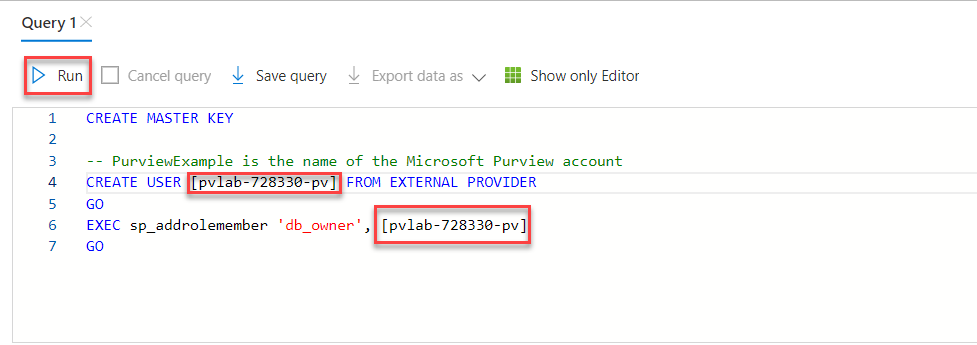


## 3. Add example tables and stored procedure to Azure SQL Database

1. Clear the Query editor and run the script below. This script will create two tables (**SourceTest** and **DestinationTest**), insert 3 rows of test data, and add a stored procedure to copy a row from **SourceTest** to **DestinationTest**.

```sql
CREATE TABLE [dbo].[SourceTest](
ID int PRIMARY KEY,
FirstName nvarchar(50),
LastName nvarchar(50)
);
GO

CREATE TABLE [dbo].[DestinationTest](
ID INT NOT NULL IDENTITY PRIMARY KEY,
SourceId INT,
FirstName NVARCHAR(50),
LastName NVARCHAR(50),
CreateDate DATETIME
);
GO
ALTER TABLE [dbo].[DestinationTest] ADD CONSTRAINT DF_DestinationTest DEFAULT GETDATE() FOR CreateDate
GO

INSERT INTO dbo.SourceTest
(ID, FirstName, LastName)
VALUES (1, 'Bob', 'Smith');
GO

INSERT INTO dbo.SourceTest
(ID, FirstName, LastName)
VALUES (2, 'Mike', 'Jones');
GO

INSERT INTO dbo.SourceTest
(ID, FirstName, LastName)
VALUES (3, 'Becky', 'McDonald');
GO

CREATE PROCEDURE dbo.MoveDataTest 
@UserId int
AS
INSERT INTO dbo.DestinationTest
(SourceId, FirstName, LastName)
SELECT ID, FirstName, LastName
FROM dbo.SourceTest
WHERE dbo.SourceTest.ID = @UserId
```  


 > **Note**: We'll be returning to the Query editor shortly, so we recommend opening the Microsoft Purview portal, if not already open, in another tab for convenience as you progress in the next steps.


## 4. Add a new Azure SQL Database Scan with lineage enabled

1. Open the **Microsoft Purview Governance Portal**, navigate to **Data map** > **Sources**, and within the Azure SQL Database tile, click the **New Scan** button.

    

  > **Note**: If you do not have the Azure SQL Database source already configured, please see [module 02B](../modules/module02b.md) for adding the database as a source.

2. Assign the scan a name, such as `Scan-Lineage`. Select your **Database name** (e.g. `pvlab-{randomID}-sqldb`), set the **Credential** to `Microsoft Purview MSI`, ensure **Lineage extraction** is `On`, and click **Test connection**. Once the connection test is successful, click **Continue**.

    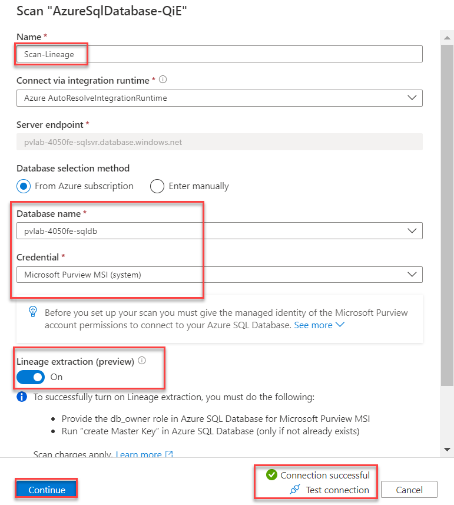

 > **Note**: If the "Test connection" appears to be hanging, click Cancel and re-try. This may happen if the database has been inactive and deprovisioned. 
If the "Test connection" fails because of a permissions issue, ensure the earlier steps have been followed to add the Microsoft Purview MSI to the db_owner role.

3. When the list of database tables appears, select our two new tables, **dbo.SourceTest** and **dbo.DestinationTest**. All others can be deselected, as they were configured in the previous scan. Click **Continue**
    
    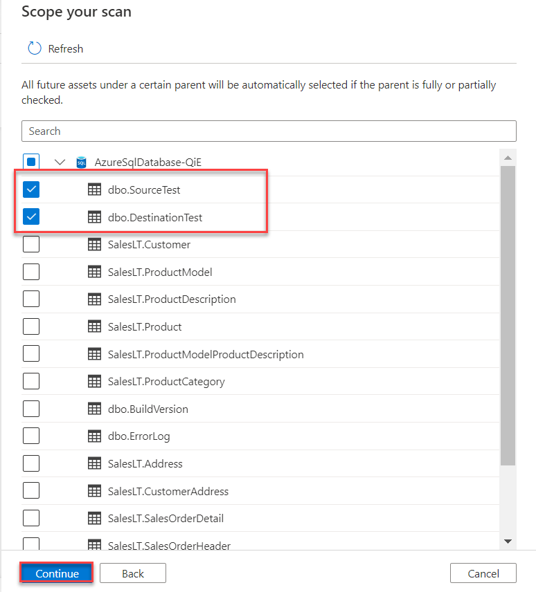

4. Click **Continue**, and **Continue** again accepting the default scan rule set.

    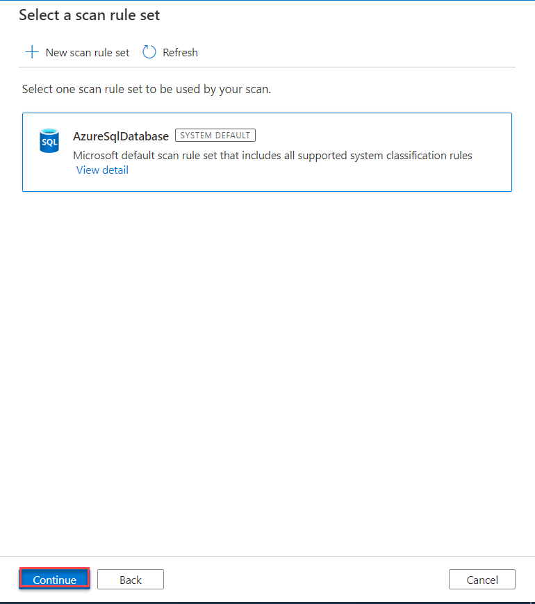

5. Set the trigger to **Once**, click **Continue**.

    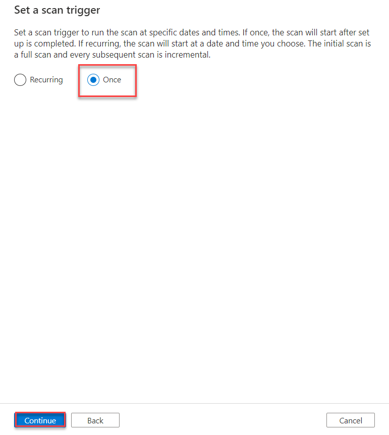

6. On the **Review your scan** page cilck on **Save and run.**

     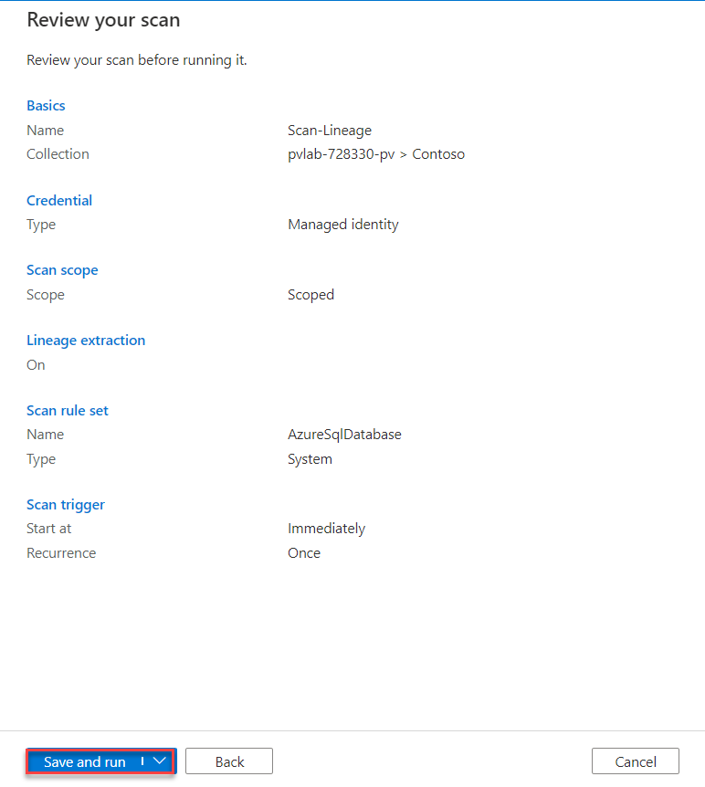
     
7. Once the scan has been saved, it will be queued for execution. Navigate to the scan history by selecting **View Details** on the Azure SQL Database connection on the **Data Map**. 

    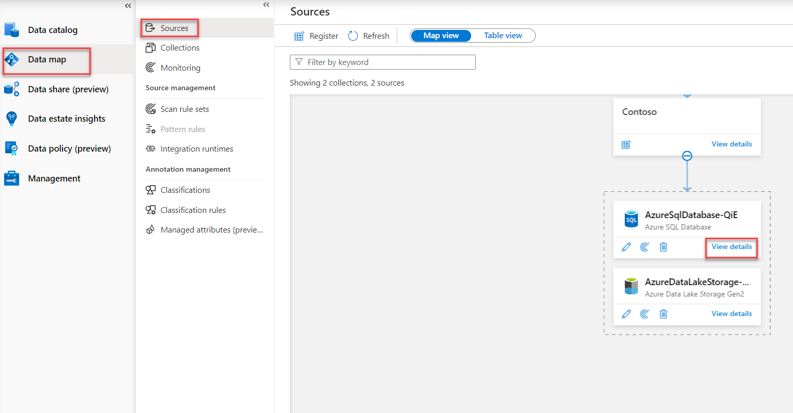

8. Select the scan name you created, `Scan-Lineage` under the Recent scans section. You may see multiple scans here from previous modules.

    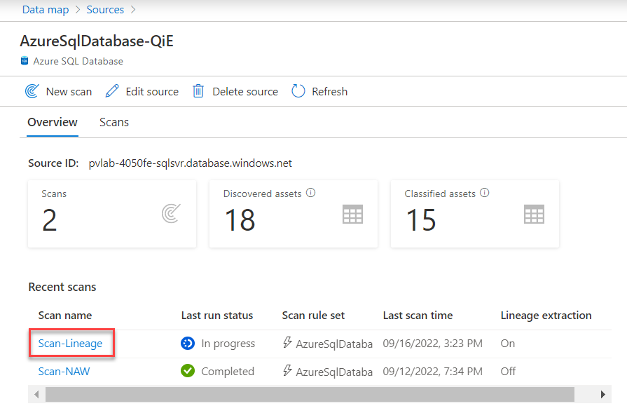

8. Observe it actually created two scans. One for the lineage, and the other for the tables. These scans may still be running, or they may be completed.

    
 
 > **Note**: It might take few minutes for the status to appear as **Completed**.
  
 > **Note**: Keep this page open in the Microsoft Purview portal as we'll be returning here shortly.


## 5. Execute the stored procedure to simulate data movement

1. Naviagte back to azure portal where the Query editor window is open, clear the Query editor once again, and **Run** the script below. This will execute the stored procedure created above, simulating data movement of rows from **SourceTest** to **DestinationTest**. The select statement should show the row in the **DestinationTest** table.

```sql
EXEC dbo.MoveDataTest 3
EXEC dbo.MoveDataTest 1
EXEC dbo.MoveDataTest 2
EXEC dbo.MoveDataTest 2

SELECT * FROM dbo.DestinationTest
```  

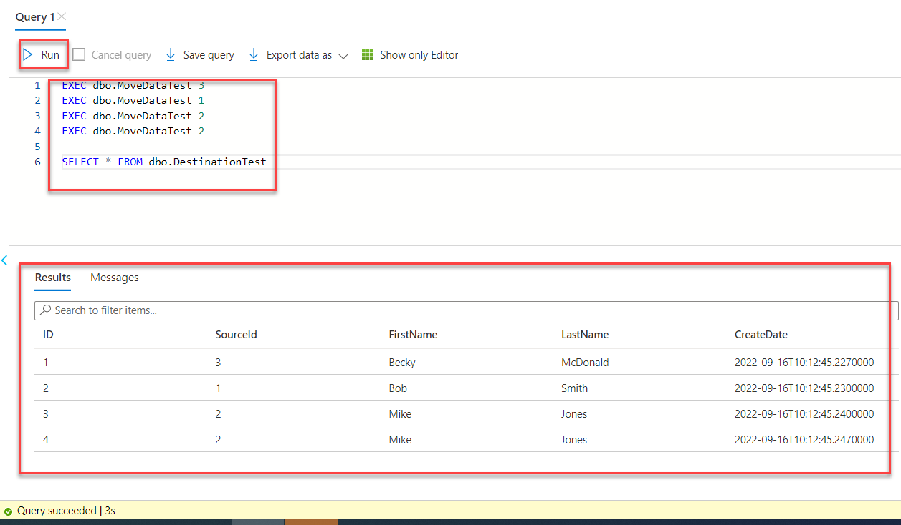


## 6. Re-run lineage scan and observe output

  
1. On the Microsoft Purview portal tab, we can manually trigger a run of the scan in order to pick up the lineage. In a typical production environment, these scans     would run periodically, but we only run them as needed in dev/test. To trigger the scan, click **Run scan now** > **Full scan** and observe the scan has been Queued   once more.

    

>**Did you know?**
>
> In order for Microsoft Purview to detect the lineage, it observes the actual execution of the stored procedure. Therefore, the lineage will not be detected until there is an execution of the MoveDataTest stored procedure.

2. In a few moments, the scan will complete. You may need to refresh the page to check on the run status. Once the scans have completed, the scan history should look similar to the image below.

    

3. To observe the lineage, select **Data Catalog** > **Browse**, select the **Contoso** collection, .

    

4. Select the **SourceTest** table on **Browse assets** page.

    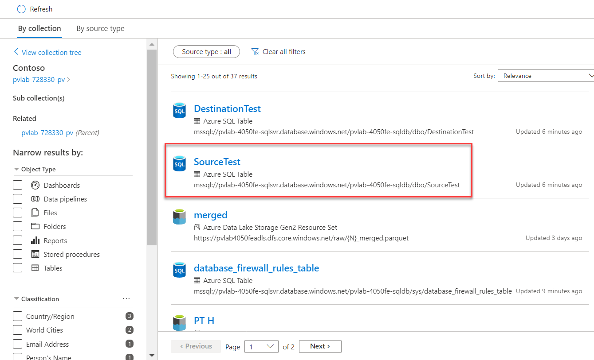

5. Navigate to the **Lineage** tab, and observe the lineage from SourceTest to DestinationTest via the MoveDataTest stored procedure.

    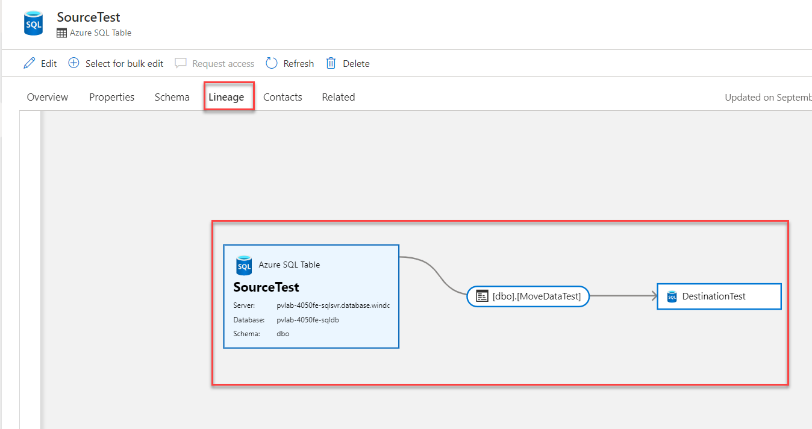


## 7. Clean-up and considerations

The lineage scan will automatically run every 6 hours. For development/testing purposes, consider deleting the scan when not needed - particularly if the database is set to deallocate after an idle period (as the database in this lab is configured to do). Running the scan periodically will resume the database.

1. If you would like to delete the artifacts created in this module, you can navigate back to azure portal where the Query editor window is open, clear the Query editor once again, and **Run** the script below. 

```sql
drop procedure dbo.MoveDataTest
drop table dbo.SourceTest
drop table dbo.DestinationTest
```
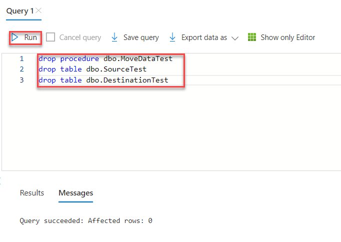


## Troubleshooting / FAQ

### Do I have to assign an AD Admin to the Azure SQL Database to add the Microsoft Purview Managed Identity?

Yes. Adding the Microsoft Purview Managed Identity to the Azure SQL Database requires an AD user with sufficient priviledge; you won't be able to add a Managed Identity with SQL-Auth.

### Can I use a SQL-Auth account with appropriate permissions, and configure the scan to use that account instead of the Managed Identity (similar to what is done in Module 02B)?

You can, but the recommended approach is to use Managed Identity. If you'd like to use a SQL-Auth account or have no way to use a AD account, consider creating a different account specifically for scanning. To do so, use a tool like Azure Data Studio to connect to the master database, create a login (in the master database) and a user (in the sample database) using SQL statements, and assign the user to the appropriate db-owner role. This credential can be stored in Azure Key Vault the same way as it is done in the earlier modules.

The below script is an example of how to create a new login and user called `PurviewScanner`:

```sql
-- in the master database
CREATE LOGIN [PurviewScanner] WITH PASSWORD = '<strongpassword>';
```

```sql
-- in the sample database
CREATE USER [PurviewScanner] FROM LOGIN PurviewScanner;
GO

EXEC sp_addrolemember 'db_owner', [PurviewScanner] 
GO
```
### Where can I learn more about this feature?

Read more about Azure SQL Database lineage extraction in the [Azure blog located here](https://azure.microsoft.com/en-us/blog/introducing-dynamic-lineage-extraction-from-azure-sql-databases-in-azure-purview/) and on [Microsoft Docs](https://docs.microsoft.com/en-us/azure/purview/register-scan-azure-sql-database?tabs=sql-authentication#lineagepreview).

## Knowledge Check

1. When creating a scan with Lineage Extraction enabled, how many scans are actually created as a result?

    A ) One  
    B ) Two  
    C ) Three  

2. The Microsoft Purview lineage scanner for Azure SQL Database requires a user with which database role permission?

    A ) db_datareader  
    B ) db_owner  
    C ) db_securityadmin  

3. When is lineage information extracted from the database?

    A ) Lineage information is extracted when initial scan is completed  
    B ) Lineage information is extracted after the initial scan is configured, and after there is at least one execution of a stored procedure the scanner will detect the lineage on the next scan run  
    C ) When the stored procedure executes, lineage information is pushed to Microsoft Purview  

4. Extra credit: Can lineage extraction occur from an ad-hoc SQL statement that moves data like the stored procedure?

    A ) Yes  
    B ) No  

<div align="right"><a href="#module-15---azure-sql-database-lineage-extraction">↥ back to top</a></div>

 ## Summary

In this module, you learned how to configure Microsoft Purview to extract lineage information from stored procedures.

